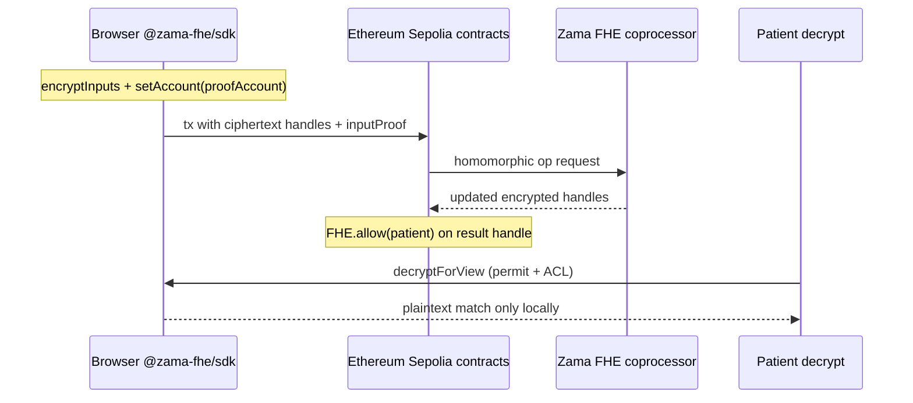
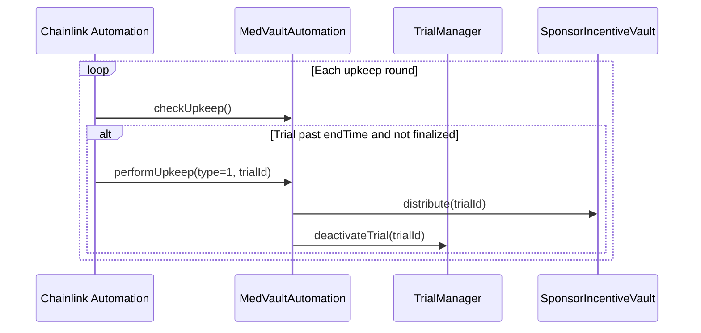

# MedVault — Private, FHE-Powered Clinical Trials

[](https://docs.zama.org)
[](LICENSE)
[](docs/TEST_MATRIX.md)
[](https://sepolia.etherscan.io/)
[](https://chain.link/automation)

**MedVault** is a **Zama FHE reference dApp** on **Ethereum Sepolia**: homomorphic trial matching on encrypted patient vitals **and encrypted sponsor criteria**, encrypted aggregate analytics, FHE-bound attestation seals, and local decrypt via `@zama-fhe/sdk`.

**Live app:** [https://med-vault.xyz](https://med-vault.xyz) (hosted on [Vercel](https://vercel.com); see [Deployment](#deployment)).  
**Repo:** [github.com/shery8595/Med-Vault](https://github.com/shery8595/Med-Vault)  
**FHE audit map (judges):** [docs/FHE_AUDIT_README.md](docs/FHE_AUDIT_README.md)

### What is encrypted vs public

| Data | On-chain |
|------|----------|
| Patient vitals (age, Hb, BMI, flags) | **Encrypted** (`euint8` / `euint16` / `ebool`) |
| Sponsor trial criteria (bounds, flags) | **Encrypted** via `createTrialWithEncryptedCriteria` |
| Eligibility result & propensity score | **Encrypted** (`ebool` / `euint8`) |
| Trial aggregate match stats | **Encrypted** (`euint64` sum + `euint32` count) |
| Trial name, phase, sponsor address | Public metadata |
| Native ETH `msg.value` on fund/deposit | Public at tx layer |

> **Augmentation layers** (optional, not required for the FHE story): Semaphore anonymous apply, Noir FHE-bound attestation seal, Chainlink Automation expiry, The Graph indexing, gasless relayer, TypeScript SDK, MCP server, Android APK — see [Appendix: augmentation layers](#appendix-augmentation-layers).

---

## Table of contents

1. [Zama FHE — the core of MedVault](#zama-fhe--the-core-of-medvault)
2. [What MedVault does](#what-medvault-does)
3. [Privacy stack: Semaphore & Noir](#privacy-stack-semaphore--noir)
4. [Architecture](#architecture)
5. [Smart contracts](#smart-contracts)
6. [Repository layout](#repository-layout)
7. [Getting started](#getting-started)
8. [Environment variables](#environment-variables)
9. [Testing](#testing)
10. [Noir circuit & Honk verifier](#noir-circuit--honk-verifier)
11. [Semaphore (anonymous trials)](#semaphore-anonymous-trials)
12. [Chainlink Automation](#chainlink-automation)
13. [The Graph subgraph](#the-graph-subgraph)
14. [Gasless relayer](#gasless-relayer)
15. [TypeScript SDK](#typescript-sdk)
16. [MCP server (AI tools)](#mcp-server-ai-tools)
17. [Deployment](#deployment)
18. [Android demo APK](#android-demo-apk-capacitor)
19. [Documentation](#documentation)

---

## Zama FHE — the core of MedVault

> **Why Zama?** Clinical trials need *computation* on sensitive vitals (age, HbA1c, BMI, comorbidities) — not just hiding values in a vault. Zama FHE lets sponsors define **encrypted inclusion criteria** and lets patients learn **encrypted match results** while validators and indexers never see plaintext PHI.

MedVault is a **reference dApp for Zama on Ethereum Sepolia**: encrypted profiles, homomorphic eligibility scoring, encrypted consent gates, confidential incentive accounting, and local decrypt — all through the official Zama SDK and `FHE.sol` contracts.

### What runs on Zama in this repo

| MedVault capability | Zama primitive |
|---------------------|------------------|
| Medical vault (age, Hb, diabetes flag, …) | `euint8` / `euint16` + `InEuint*` + `inputProof` |
| **Encrypted sponsor criteria** | `createTrialWithEncryptedCriteria` — sponsor bounds hidden on-chain |
| Trial rubric vs encrypted profile | `FHE.ge`, `FHE.le`, `FHE.eq`, `FHE.select` in `EligibilityEngine` |
| **Batch eligibility** | `checkEligibilityBatch` — N trials in one authorized call |
| **Encrypted aggregates** | `FHE.add` on scores/counts in `EncryptedScoreLeaderboard` |
| Consent-aware eligibility | `ebool` + `EncryptedConsentGate` |
| Encrypted propensity / leaderboard signals | `EncryptedScoreLeaderboard` commits |
| Private balances & trial stakes | `euint64` in `ConfidentialETH` / vault flows |
| Patient views match outcome | ACL (`FHE.allow`) + `@zama-fhe/sdk` decrypt |

**Semaphore** hides *who* applied; **Noir** seals a public compliance receipt bound to the Zama FHE stage — but **every clinical comparison happens in Zama ciphertext space.**

### Zama FHE architecture (four layers)



1. **Browser** — `@zama-fhe/sdk` encrypts vitals; proofs bound to a **proof account** (EOA or contract).
2. **EVM** — Stores handles; calls FHE precompiles; `FHE.allow` / `FHE.allowThis` ACL.
3. **Coprocessor** — Executes homomorphic math off-chain; chain keeps ciphertext.
4. **Decrypt** — Only ACL-approved paths; plaintext never written to chain state.

### Packages (pinned in `package.json`)

| Package | Role in MedVault |
|---------|------------------|
| [`@fhevm/solidity`](https://www.npmjs.com/package/@fhevm/solidity) | `FHE.sol`, `euint*`, `InEuint*`, `fromExternal` |
| [`@zama-fhe/sdk`](https://www.npmjs.com/package/@zama-fhe/sdk) | Browser: `encryptInputs`, `connect`, `decryptForView` |
| [`@fhevm/hardhat-plugin`](https://www.npmjs.com/package/@fhevm/hardhat-plugin) | Tests: `hre.fhevm.createClientWithBatteries`, mock decrypt |
| `@zama-fhe/sdk/chains` (`sepolia`) | Chain metadata + verifier URL |

### Frontend integration

- **Entry:** `src/lib/fhe.ts` — `ensureZamaConnected`, `encryptPatientProfile`, `decryptEligibility`, ephemeral `forceConnectFHE` for anonymous flows.
- **Wallet:** Privy → ethers signer → `Ethers6Adapter` on Zama SDK client.
- **Verifier URL:** `/api/relayer` → Ethereum Sepolia testnet VRF (`relayer.testnet.zama.org`) via Vite dev proxy and `vercel.json` in production.
- **`useWorkers: false`** in dev — Zama FHE workers cannot use the Vite proxy (avoids bad proofs / CORS).

```typescript
// Proof account MUST match msg.sender at the contract verify site
await client
  .encryptInputs([Encryptable.uint8(age), Encryptable.uint16(hbA1c)])
  .setAccount(proofAccount)  // e.g. MedVaultRegistry address for registerPatient
  .execute();
```

### Solidity contracts using FHE

| Contract | Zama usage |
|----------|----------------|
| `EligibilityEngine` | Core homomorphic trial matching |
| `MedVaultRegistry` / `AnonymousPatientRegistry` | Encrypted profile storage |
| `ConsentManager` / `EncryptedConsentGate` | Encrypted consent + gating |
| `EncryptedScoreLeaderboard` | Encrypted propensity commits |
| `ConfidentialETH` | Encrypted balances |
| `SponsorIncentiveVault` | FHE-aware payout paths where applicable |

### Local FHE development & CI

```bash
npm run compile          # Hardhat + Zama FHE types
npm run test:unit        # 148 cases with @fhevm/hardhat-plugin mocks
```

Shared helpers: `test-support/fhe.ts` (`buildPatientProfileInputs`, `mockDecryptBool`).  
**#1 testnet pitfall:** wrong `setAccount` → `InvalidSigner` — see proof-account table in in-app **Docs → Zama FHE**.

### Learn more

- In-app: **Docs → Zama FHE** (`/docs/zama-fhe`) and **FHE primitives** (`/docs/fhe-primitives`)
- Zama: [docs.zama.org](https://docs.zama.org) · Zama FHE docs on the Zama developer hub

---

## What MedVault does

| Role | Capabilities |
|------|----------------|
| **Patient** | Register an encrypted medical profile (Zama FHE), discover trials, apply with wallet or **anonymous Semaphore** identity, grant consent, decrypt eligibility locally, optional **compliance seal** (Noir attestation bound to the Zama FHE stage). |
| **Sponsor** | Create protocols, fund incentive pools, review aggregate matches (no plaintext PHI), audit trail, milestone payouts via vault + Chainlink automation. |
| **Compliance** | `DataAccessLog` records anonymized hashes; consent scoped per `(patient, trial)`; Reclaim attestation optional on profile upload. |

Recent product areas: FHIR JSON prefill, sponsor representation monitoring, encrypted propensity signals (subgraph), fast audit log via `DetailedActionLogged` events, patient wallet gating when logged out.

---

## Privacy stack: Semaphore & Noir

**Zama FHE is the primary privacy layer** — see [Zama FHE — the core of MedVault](#zama-fhe--the-core-of-medvault). Semaphore and Noir extend that foundation:


### Semaphore v4 (anonymous identity)

- **Purpose:** Apply to trials without linking the application to the patient’s main wallet on-chain.
- **Libraries:** `@semaphore-protocol/identity`, `group`, `proof`; on-chain `Semaphore` + `MedVaultRegistry`.
- **Flow:** Ephemeral identity in browser → Merkle proof → `AnonymousApplication` / staged apply → FHE eligibility with consent gate.
- **Code:** `src/lib/semaphore.ts`, `contracts/MedVaultRegistry.sol`, `contracts/AnonymousPatientRegistry.sol`.
- **Tests:** `test-support/semaphore.ts`, `MockSemaphore.sol`, integration tests `MVR-*`, `INT-EE-*`.

### Noir + Honk (public attestation seal)

- **Role:** Narrow compliance layer — binds Semaphore nullifier, profile commitment, trial scope, criteria schema version, and **Zama FHE stage handle** to a public receipt. **Zama FHE remains the compute authority** for eligibility and scoring.
- **Circuit:** `circuits/eligibility_proof/` — 16 public inputs including `fhe_stage_handle_hash` and `criteria_schema_hash`.
- **Verifier:** `contracts/HonkVerifier.sol` generated with **Keccak transcript** (`evm-no-zk`) to match `@aztec/bb.js` in the browser.
- **Client:** `@noir-lang/noir_js` + bundled `eligibility_proof.json`; UI “Seal FHE result” / compliance seal step.
- **On-chain:** `attestationReceipt(nullifier, trialId)` for sponsor audit (no PHI). Subgraph indexes attestation hashes only.
- **Tests:** `test/unit/attestation-binding.test.ts`, `test/crypto/noir-nullifier.test.ts` (CI); `test/crypto/honk-pipeline.test.ts` (optional, slow).

**Residual caveat:** The Noir seal cryptographically binds the witness to the staged `fhe_stage_handle_hash` (private `staged_fhe_handle` assert in circuit + on-chain hash check). Full proof that FHE ciphertext plaintext equals the Noir witness still requires Zama input-proof primitives in-circuit (future).

### Known privacy limits (honest disclosure)

- **Registration:** Direct `registerPatient` links wallet ↔ commitment in one tx. Use `registerPatientViaRelayer` (EIP-712 + `POST /relay/register`) so `tx.from` is the relayer, not the patient wallet. `registered[wallet]` is still set for UX; `walletToCommitment` is not stored on the relayer path.
- **Native ETH:** `msg.value` on `deposit`, `fundTrial`, and `stake` is visible at the transaction layer even when contract events omit amounts.
- **ERC-20 / aWETH:** Aave supply and withdraw paths emit standard token transfer events with amounts.
- **Pool size:** `getTotalDeposited` is sponsor-only; participants should use encrypted pool handles, not public totals.
- **Reward claim:** `ClaimInitiated` omits destination and nullifier; claim amounts are encrypted (`externalEuint64`). ETH still arrives at the chosen address when withdraw completes (amount visible at settlement).
- **Withdrawal staging:** `WithdrawRequested` / `WithdrawToRequested` expose only `sufficientHandle`, not plaintext amounts. Pending withdraw state is `euint64`.
- **Public exit:** `completePublicExit` sends native ETH to a signed stealth recipient; final transfer value is public. Relayer submission hides gas payer; batching improves timing unlinkability only.
- **Private unstake:** Returns encrypted stake to cETH without Aave ERC-20 events. Public `requestPublicUnstake` remains an explicit visible exit.
- **Subgraph:** Wallet↔commitment links are not reconstructed from `transaction.from`; consent wallet↔trial rows are not indexed.

| Layer | Role | Hides on-chain |
|-------|------|----------------|
| **Zama FHE** | **Encrypted compute + storage** | Plaintext vitals & criteria |
| Semaphore | Identity | Wallet ↔ application link |
| Noir | Attestation seal | Forged identity vs Semaphore nullifier; replay across trials/stages |

---

## Architecture


**Indexing:** The Graph (`subgraph/`) for trials, applications, consents, anonymous submissions, incentive pools — not for all audit data until `DataAccessLog` is deployed to Studio.

**Automation:** [Chainlink Automation](#chainlink-automation) finalizes expired trials via `MedVaultAutomation` (not indexed by subgraph).

---

## Smart contracts

Deployed addresses: `src/lib/contracts/addresses.json` (`sepolia`).

| Contract | Role |
|----------|------|
| `MedVaultRegistry` | Patient registration, anonymous apply staging/finalize |
| `AnonymousPatientRegistry` | Commitment-based profiles + data access events |
| `EligibilityEngine` | FHE matching, applications, anonymous eligibility |
| `ConsentManager` / `EncryptedConsentGate` | Consent records + encrypted gate |
| `TrialManager` | Trial metadata lifecycle |
| `SponsorRegistry` | Sponsor verification |
| `SponsorIncentiveVault` | Trial incentive pools & payouts |
| `TrialMilestoneManager` | Milestone weights & completion |
| `MedVaultAutomation` | Chainlink Automation — trial expiry finalization |
| `DataAccessLog` | Immutable audit entries (`ActionLogged` / `DetailedActionLogged`) |
| `HonkVerifier` | Noir Honk proof verification |
| `ConfidentialETH` / `StakingManager` | Encrypted balances; dual staking/unstake paths; EIP-712 public exit |
| `EncryptedScoreLeaderboard` | Encrypted propensity commits |

Compile: `npm run compile` · ABIs synced to frontend/subgraph: `npm run sync-abis`

---

## Repository layout

```
medvault/
├── contracts/              # Solidity 0.8.27 (FHE, Semaphore, Noir verifier)
├── circuits/eligibility_proof/  # Noir circuit (Nargo)
├── src/                    # React dApp (patient + sponsor portals)
├── android/                # Capacitor Android project (demo APK)
├── capacitor.config.ts     # Capacitor app id + webDir
├── subgraph/               # The Graph schema + mappings
├── relayer/                # Optional gasless finalize server
├── packages/medvault-sdk/  # @medvault/sdk — integrator facade (trials, sponsor, relayer client)
├── packages/medvault-core/ # Protocol helpers (contracts, subgraph, sponsor ops)
├── mcp-server/             # Local MCP server (stdio + optional HTTP)
├── config/mcp/             # MCP client config snippets (Cursor, Codex, …)
├── test/                   # Hardhat tests (see Testing)
├── test-support/           # deployMedVaultStack, FHE, Semaphore helpers
├── scripts/                # Deploy, circuit build, subgraph, wiring
└── docs/                   # TESTING_GUIDE, ANDROID_APK, MOBILE_ARCHITECTURE, …
```

---

## Getting started

### Prerequisites

| Tool | Version / notes |
|------|-----------------|
| **Node.js** | 20+ (`engines` in `package.json`) |
| **npm** | 7+ |
| **Wallet** | Ethereum Sepolia ETH (Privy in-app wallet supported) |
| **Noir (optional)** | WSL + `nargo` **1.0.0-beta.21** for `npm run build:circuit` |
| **Graph CLI (optional)** | For `subgraph:deploy` |

### Install & run frontend

```bash
git clone https://github.com/shery8595/Med-Vault.git
cd Med-Vault
npm install
cp .env.example .env.local   # fill VITE_PRIVY_APP_ID, VITE_SUBGRAPH_URL, etc.
npm run compile              # contracts (needed for typechain / some scripts)
npm run dev                  # http://localhost:3000
```

Vite proxies `/relay` → relayer when configured; Zama FHE VRF via `/api/relayer` in `vercel.json`.

---

## Environment variables

Copy `.env.example` → `.env.local` (never commit secrets).

| Variable | Purpose |
|----------|---------|
| `VITE_PRIVY_APP_ID` | Required — login / embedded wallet |
| `VITE_SUBGRAPH_URL` | The Graph Studio query URL (must match Playground) |
| `GRAPH_SUBGRAPH_SLUG` | Studio slug (e.g. `medvault-final`) |
| `VITE_RECLAIM_*` | Optional profile attestation (Reclaim Protocol) |
| `VITE_RECLAIM_ALLOW_SKIP` | `true` = skip Reclaim in dev |
| `VITE_RELAYER_URL` | Gasless finalize (default: same-origin `/relay`) |
| `VITE_TESTNET_FAUCET_URL` | Optional drip service for testnet ETH |
| `SEPOLIA_RPC_URL` | Hardhat / scripts |
| `PRIVATE_KEY` | Deploy scripts only — **never** commit |

**MCP server** (local IDE only — see [MCP server](#mcp-server-ai-tools)): `MEDVAULT_SUBGRAPH_URL`, `MCP_PRIVATE_KEY`, optional `MEDVAULT_SPONSOR_OPEN_ACCESS`, `MCP_MAX_ETH_PER_TX`. Documented in `.env.example`; not required for the web app.

Relayer (`relayer/.env.example`): `REGISTRY_ADDRESS`, `SEMAPHORE_ADDRESS`, `RELAYER_PRIVATE_KEY`, `RPC_URL`, optional batch exit `MIN_BATCH_SIZE` / `MAX_WAIT_MS`. Authorize relayer on `ConfidentialETH` for withdraw completion helpers.

Private withdrawals: see [docs/PRIVATE_WITHDRAWALS.md](docs/PRIVATE_WITHDRAWALS.md) and in-app `/docs/private-withdrawals`.

---

## Testing

MedVault uses **Hardhat 2**, **Mocha/Chai**, and **`@fhevm/hardhat-plugin`** (Zama FHE mocks). Default CI run: **265 passing** (+ 2 pending, 1 optional Honk).

| Suite | Cases | Command |
|-------|-------|---------|
| Smoke + unit + staking | ~184 | `npm run test:unit` |
| Integration | 62 | `npm run test:integration` |
| Crypto (Noir nullifier alignment) | 3 | `npm run test:crypto` |
| Honk full pipeline (slow) | 1 | `npm run test:honk` |
| **Default** | **265** | `npm test` |

```bash
npm run compile
npm test
npm run test:coverage    # solidity-coverage
```

### Layout

```
test/
  smoke/           # deployMedVaultStack + Zama FHE smoke (4)
  unit/            # Per-contract tests (~140)
  integration/     # Cross-contract + E2E (40)
  staking/         # StakingManager + MockAave (8)
  crypto/          # Noir nullifier + optional Honk

test-support/
  deployments.ts   # deployMedVaultStack()
  fhe.ts           # Zama FHE encrypt / mock decrypt
  semaphore.ts     # MockSemaphore proofs
  consent.ts       # grantConsent overload helpers
  signers.ts       # impersonateAccount
```

### CI

- **Contracts:** `.github/workflows/contracts-test.yml` — `compile` → `test:unit` → `test:integration` → `test:crypto` (Honk excluded).
- **Production app:** `.github/workflows/vercel-prebuilt.yml` — build on `main` push, `vercel deploy --prebuilt --prod`.

### In-app docs

Open the dApp → **Docs → Tests & verification** (`/docs/testing`) for overview, matrix, infrastructure, and CI mirrors.

**Deep dives:** [docs/TESTING_GUIDE.md](docs/TESTING_GUIDE.md) · [docs/TEST_MATRIX.md](docs/TEST_MATRIX.md)

---

## Noir circuit & Honk verifier

**Circuit:** `circuits/eligibility_proof/src/main.nr` — compliance attestation mirror, not a second eligibility engine.

Public inputs (16): `scope`, `nullifier`, `profile_commitment`, `result_hash`, `eligible`, `fhe_stage_handle_hash`, `criteria_schema_hash`, plus nine trial criteria fields.  
Private: Semaphore `secret`, `scope_internal`, profile fields used to recompute commitments.

**Build (WSL recommended on Windows):**

```bash
npm run build:circuit
# Runs scripts/compile-circuit.js → nargo compile + bb Keccak Honk →
#   circuits/eligibility_proof/target/eligibility_proof.json
#   contracts/HonkVerifier.sol
#   src/lib/circuits/eligibility_proof.json
```

**Redeploy verifier on testnet:**

```bash
npx hardhat compile
npx hardhat run scripts/deploy-verifier.ts --network sepolia
# Wire engine: scripts in repo (e.g. finish-wiring.ts) as needed
```

After circuit or verifier changes: restart `npm run dev` and hard-refresh before **Seal FHE result**.

**Optional:** `npm run test:honk` after `build:circuit` (~3–5 min).

---

## Semaphore (anonymous trials)

1. **Identity** — `createIdentity()` / localStorage (`src/lib/semaphore.ts`).
2. **Group** — commitments from `MedVaultRegistry` `PatientRegistered` events.
3. **Proof** — `generateAnonymousProof()` for trial scope (trial id → scope field).
4. **On-chain** — `stageAnonymousApply` → FHE eligibility + consent → `finalize` (wallet or **relayer**).

**Ephemeral Zama FHE permit:** Derived from identity secret so decryption keys stay off the main wallet.

**Nullifier storage:** Per-trial nullifiers in localStorage to prevent double-apply in the UI.

Contracts: `Semaphore` + `MedVaultRegistry` addresses in `addresses.json`.  
Tests: `test/integration/medvault-registry.test.ts`, `test/integration/eligibility-anonymous.test.ts`.

---

## Chainlink Automation

MedVault uses **[Chainlink Automation](https://chain.link/automation)** on **Ethereum Sepolia** so expired clinical protocols finalize **without a sponsor manually clicking “distribute & close.”** This is separate from FHE matching (Zama FHE) and from **milestone** payouts (`TrialMilestoneManager`), which sponsors trigger during an active trial.

### What `MedVaultAutomation.sol` does

| Step | On-chain action |
|------|-----------------|
| **`checkUpkeep`** | Scans **active** trial IDs (tracked when `TrialManager` creates/deactivates trials). Returns `true` when `block.timestamp >= trial.endTime` and the trial is not yet finalized. |
| **`performUpkeep`** (task type `1`) | Marks trial finalized → calls `SponsorIncentiveVault.distribute(trialId)` → calls `TrialManager.deactivateTrial(trialId)`. |



### Security model

- **`onlyForwarder`** — `performUpkeep` accepts calls only from the configured **Chainlink forwarder** (or `owner` for testing).
- **`setChainlinkForwarder`** — Owner sets the forwarder address from the Chainlink Automation UI after registering upkeep.
- **Two-step ownership** — Same pattern as other admin contracts (`proposeOwnership` / `acceptOwnership`).

### Related Chainlink usage

| Component | Chainlink feature |
|-----------|-------------------|
| `MedVaultAutomation` | **Automation** — expiry finalization |
| `TrialManager` | **Price feeds** (optional) — ETH/USD style compensation helpers where configured |

### Operator setup (testnet)

1. Deploy stack (`scripts/deploy.ts`, `finish-wiring.ts`) so `MedVaultAutomation` points at `TrialManager` + `SponsorIncentiveVault`.
2. Register an upkeep in the [Chainlink Automation app](https://automation.chain.link/) for `MedVaultAutomation` on Ethereum Sepolia (`checkUpkeep` / `performUpkeep`).
3. Set the forwarder on-chain (required — upkeep simulations revert until this is set):

```bash
CHAINLINK_FORWARDER=0xYourForwarderFromChainlinkUI \
  npm run deploy:chainlink-forwarder:sepolia
```

4. Diagnose wiring:

```bash
npx hardhat run scripts/diagnose-automation-upkeep.ts --network sepolia
```

### Tests & docs

- Hardhat: `test/unit/medvault-automation.test.ts` (case IDs `MVA-01`–`MVA-06` in [docs/TEST_MATRIX.md](docs/TEST_MATRIX.md))
- In-app: **Docs → Chainlink Automation** (`/docs/automation`)

---

## The Graph subgraph

- **Schema:** `subgraph/schema.graphql` — `Trial`, `Application`, `Consent`, `AnonymousSubmission`, `IncentivePool`, `AuditLog`, …
- **Network:** `sepolia`
- **Config:** `subgraph/subgraph.yaml` — includes `DataAccessLog` → `ActionLogged` (redeploy required for audit entities in Studio)

```bash
npm run sync-abis
npm run subgraph:prepare          # codegen + build
npm run subgraph:deploy           # default label from package.json
# Or near head (smaller sync):
npm run subgraph:deploy:near-head -- 0.1.3
```

Set in frontend:

```env
VITE_SUBGRAPH_URL=https://api.studio.thegraph.com/query/<id>/medvault-final/<version>
```

**Audit logs in UI:** Hybrid — fast `DetailedActionLogged` `eth_getLogs` + subgraph trial scoping (`src/lib/auditLogFetch.ts`). Full subgraph-only audit needs a Studio deploy that indexes `DataAccessLog`.

**Ops guide:** [docs/SUBGRAPH_SYNC.md](docs/SUBGRAPH_SYNC.md)

---

## Gasless relayer

Optional service for **`finalizeAnonymousApplication`** and **`registerPatientViaRelayer`** when the patient should not pay gas or should not link wallet in `tx.from`.

```bash
cd relayer
cp .env.example .env
npm install
node server.js
```

Configure `VITE_RELAYER_URL` or use Vite dev proxy to `/relay`.  
Production example in `.env.example` (Railway).

---

## TypeScript SDK

**`@medvault/sdk`** — TypeScript library for integrators and scripts. **No hosting required** (unlike the relayer). Wraps `@medvault/core` with `MedVaultSDK.create()` and modules for trials, sponsor ops, protocol metadata, and relayer HTTP.

| Item | Location |
|------|----------|
| Package | `packages/medvault-sdk/` |
| Package README | [packages/medvault-sdk/README.md](packages/medvault-sdk/README.md) |
| In-app docs | [/docs/mcp/sdk](https://med-vault.xyz/docs/mcp/sdk) |

```bash
npm run sdk:build
npm run sdk:test

# After contract / ABI updates:
npm run sync-sdk-assets
```

```typescript
import { MedVaultSDK } from "@medvault/sdk";

const sdk = MedVaultSDK.create({
  subgraphUrl: process.env.MEDVAULT_SUBGRAPH_URL!,
  relayerUrl: process.env.MEDVAULT_RELAYER_URL,
});

await sdk.trials.listActive({ first: 10 });
await sdk.relayer.health();
```

**v1 scope:** subgraph reads, sponsor writes (with `signer`), `sdk.relayer.*` for gasless anonymous apply. Patient FHE / Semaphore / Noir stay in the browser dApp.

---

## MCP server (AI tools)

Local **[Model Context Protocol](https://modelcontextprotocol.io)** server for **developers** and **sponsors** — query trials, matches, audit logs, and run **sponsor transactions** from Cursor, Codex, Claude Code, ChatGPT Desktop, Google Antigravity, or OpenClaw. **Not hosted** on Vercel; each user runs it from the repo. Uses `@medvault/sdk` for config addresses.

| Item | Location |
|------|----------|
| Server | `mcp-server/` |
| SDK | `packages/medvault-sdk/` |
| Core | `packages/medvault-core/` |
| Client configs | `config/mcp/` (run `npm run mcp:export-config`) |
| In-app docs | [/docs/mcp](https://med-vault.xyz/docs/mcp) · [SDK](https://med-vault.xyz/docs/mcp/sdk) |
| Maintainer guide | [docs/MCP_SERVER.md](docs/MCP_SERVER.md) |

```bash
npm run mcp:build          # builds core + sdk + mcp-server
npm run mcp:export-config
npm run mcp:smoke          # optional sanity check
```

Set on your machine (not `VITE_*` unless you export them into the shell before starting your IDE):

| Variable | Purpose |
|----------|---------|
| `SEPOLIA_RPC_URL` | JSON-RPC for reads/writes |
| `MEDVAULT_SUBGRAPH_URL` | Same URL as `VITE_SUBGRAPH_URL` |
| `MCP_PRIVATE_KEY` | Sponsor wallet for write tools only — never commit |

**v1 scope:** read tools + sponsor writes. Patient/FHE flows stay in the browser dApp.

---

## Deployment

Production is served at **https://med-vault.xyz** (configure the custom domain in the Vercel project). Set the relayer’s `FRONTEND_URL` to that origin for CORS.

### Frontend (Git → Vercel)

Push to **`main`** triggers GitHub Actions **Vercel prebuilt production** (requires secrets `VERCEL_TOKEN`, `VERCEL_ORG_ID`, `VERCEL_PROJECT_ID`).

```bash
git push origin main
```

Manual:

```bash
npm run vercel:ship
```

### Contracts (Ethereum Sepolia)

```bash
# Examples — see scripts/ for full wiring
npx hardhat run scripts/deploy.ts --network sepolia
npx hardhat run scripts/finish-wiring.ts --network sepolia
npm run deploy:check-wiring:sepolia
```

### Chainlink Automation

After deploy, register upkeep in the Chainlink UI and set the forwarder:

```bash
CHAINLINK_FORWARDER=0x... npm run deploy:chainlink-forwarder:sepolia
```

See [Chainlink Automation](#chainlink-automation) and `scripts/diagnose-automation-upkeep.ts`.

### Subgraph

```bash
npm run subgraph:deploy:near-head -- <version>
# Update VITE_SUBGRAPH_URL in Vercel env to the new Studio version URL
```

### Android demo APK (Capacitor)

Internal sideload APK for demos — same React dapp in a WebView.

```bash
# Android Studio (recommended):
npm run mobile:studio
# → Run ▶ or Build → Build APK(s)

# CLI:
npm run mobile:apk:debug
# → android/app/build/outputs/apk/debug/app-debug.apk
```

**Ops:** add `https://localhost` to Privy allowed origins and relayer `FRONTEND_URL` (comma-separated with production). Create `android/local.properties` with your SDK path; Gradle needs **JDK 21**.

See [docs/ANDROID_APK.md](docs/ANDROID_APK.md) and in-app [/docs/mobile/android-apk](https://med-vault.xyz/docs/mobile/android-apk).

---

## Documentation

| Resource | Location |
|----------|----------|
| In-app docs (architecture, **Zama FHE**, FHE primitives, Semaphore, Noir, **Chainlink Automation**, compliance) | `/docs` in the dApp |
| **TypeScript SDK** | [/docs/mcp/sdk](https://med-vault.xyz/docs/mcp/sdk) · [packages/medvault-sdk/README.md](packages/medvault-sdk/README.md) |
| **MCP server (AI tools)** | [/docs/mcp](https://med-vault.xyz/docs/mcp) · [docs/MCP_SERVER.md](docs/MCP_SERVER.md) |
| Testing guide | [docs/TESTING_GUIDE.md](docs/TESTING_GUIDE.md) |
| Test matrix (case IDs) | [docs/TEST_MATRIX.md](docs/TEST_MATRIX.md) |
| Verification snapshot | [docs/VERIFICATION_SNAPSHOT.md](docs/VERIFICATION_SNAPSHOT.md) |
| Subgraph sync / versions | [docs/SUBGRAPH_SYNC.md](docs/SUBGRAPH_SYNC.md) |
| **Android demo APK** | [/docs/mobile/android-apk](https://med-vault.xyz/docs/mobile/android-apk) · [docs/ANDROID_APK.md](docs/ANDROID_APK.md) · [docs/MOBILE_ARCHITECTURE.md](docs/MOBILE_ARCHITECTURE.md) |
| New contracts guide | [docs/NEW_CONTRACTS_GUIDE.md](docs/NEW_CONTRACTS_GUIDE.md) |
| Phased payouts & audit notes | [docs/UPGRADE_V1.1_PHASED_PAYOUTS_AND_AUDIT.md](docs/UPGRADE_V1.1_PHASED_PAYOUTS_AND_AUDIT.md) |

---

## Tech stack (summary)

| Area | Stack |
|------|--------|
| Frontend | React 19, Vite 6, Tailwind 4, Framer Motion, Privy, Tremor |
| Web3 | ethers v6, viem (via Privy), TypeChain |
| **Zama FHE** | **`@zama-fhe/sdk`, `@fhevm/solidity`, `@fhevm/hardhat-plugin`** |
| ZK | Noir 1.0.0-beta.21, `@aztec/bb.js`, Semaphore 4.14 |
| **Chainlink** | **Automation** (`MedVaultAutomation`), optional **price feeds** (`TrialManager`) |
| Contracts | Solidity 0.8.27, Hardhat, `@chainlink/contracts` |
| Indexing | The Graph (Apollo-style hooks via `useSubgraph`) |
| **SDK** | `@medvault/sdk` + `@medvault/core` — integrator TypeScript (monorepo) |
| **MCP** | `@modelcontextprotocol/sdk` — local stdio server for sponsors/devs |
| Hosting | Vercel (static + API rewrites) |
| **Mobile** | **Capacitor 8 (Android APK demo)** |

---

## License

BSD-3-Clause-Clear — see [LICENSE](LICENSE).

---

## Appendix: augmentation layers

These extend MedVault but are **not required** to demonstrate Zama FHE:

| Layer | Role |
|-------|------|
| Semaphore | Anonymous apply without wallet↔application link |
| Noir + Honk | FHE-bound attestation seal (`staged_fhe_handle` witness binding) |
| Chainlink Automation | Trial expiry finalization |
| The Graph | Indexing trials, applications, attestation metadata |
| Gasless relayer | `POST /relay/apply-*`, `POST /relay/register` |
| `@medvault/sdk` / MCP | Sponsor/dev tooling |
| Capacitor Android | Demo APK (WebView) |

---

<div align="center">
Powered by Zama FHE · Chainlink Automation — confidential clinical research on Ethereum Sepolia
</div>
