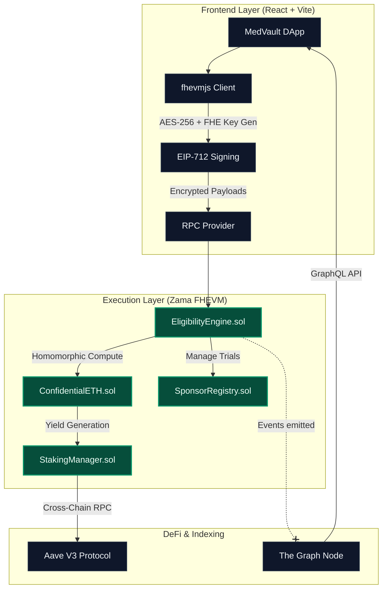
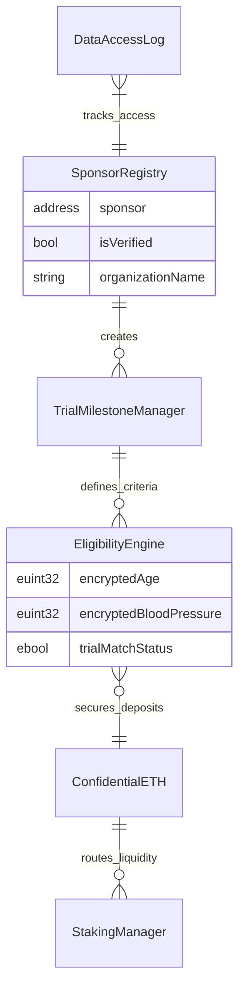
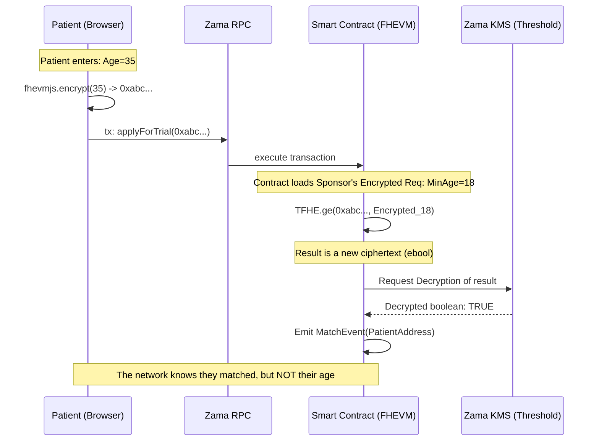
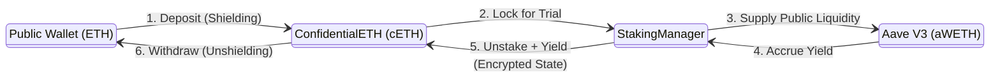
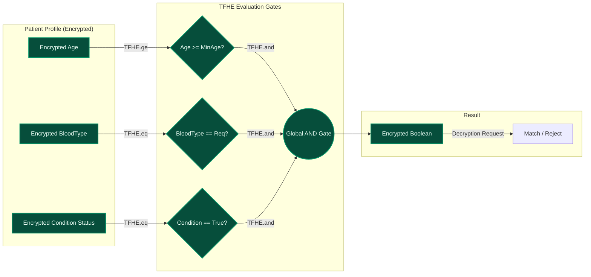
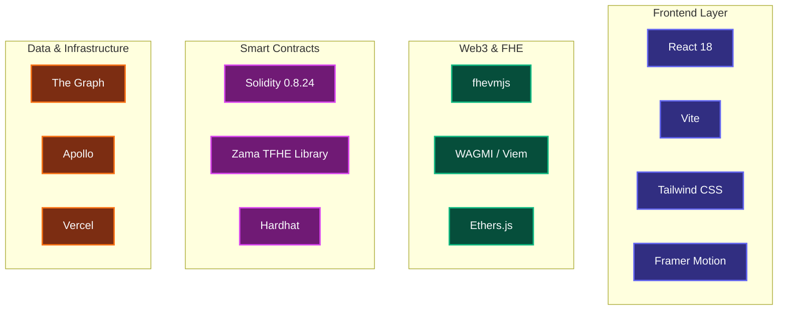

# MedVault — Private, FHE-Powered Clinical Trials

[](https://zama.ai/fhevm)
[](LICENSE)
[](docs/TESTING_GUIDE.md)
[](https://vercel.com)

**MedVault** is the first decentralized clinical trial platform leveraging **Fully Homomorphic Encryption (FHE)** to bridge the gap between medical privacy and decentralized research. Built on the Zama fhEVM, it allows patients to match with life-saving trials while keeping their medical data mathematically encrypted at all times.

</div>

---

## 🏗️ 1. Architecture Overview

MedVault uses a multi-layered approach to synchronize browser-level encryption with on-chain computation. The system ensures that patient data never exists in plaintext outside of the user's localized memory.



---

## 📜 2. Smart Contract Ecosystem

MedVault's core logic is distributed across a modular set of FHE-aware smart contracts. Each contract is designed to handle encrypted types (`euint32`, `ebool`) securely.



| Contract | Purpose | Key Feature |
|-----------|---------|-------------|
| **`EligibilityEngine.sol`** | Core Matching Logic | Homomorphic (CMUX) boundary checks on `euint32`. |
| **`ConfidentialETH.sol`** | Privacy Wrapper | 1e12 scaled `euint32` encrypted balances to prevent tracking. |
| **`StakingManager.sol`** | De-Fi Integration | Native Aave V3 yield generation on private assets. |
| **`SponsorRegistry.sol`** | Identity & Access | Strict KYC gates before trials can be published. |
| **`DataAccessLog.sol`** | Compliance Audit | Immutable, anonymized HIPAA/GDPR access tracking. |
| **`TrialMilestoneManager`** | Lifecycle Management | Automated milestone-based phased payouts. |

---

## 🔐 3. Zama FHEVM Encryption / Decryption Lifecycle

Fully Homomorphic Encryption allows the blockchain to do math on numbers it cannot see. Here is how MedVault utilizes Zama's `fhevmjs` and `TFHE.sol`.



### The Cryptographic Guarantee:
1. **Client-side Encryption:** `fhevmjs` generates a single-use public key derived from the network.
2. **On-Chain Computation:** The smart contract uses `TFHE.add()`, `TFHE.ge()`, etc., to manipulate the ciphertexts.
3. **Threshold Decryption (ACL):** Only the final binary result (e.g., "Matched? Yes/No") is allowed to be decrypted by the ACL. The raw inputs remain encrypted forever.

---

## 💰 4. Private Staking & Yield

MedVault integrates with **Aave V3** to allow sponsors and patients to earn yield on their confidential assets while they are locked in trials.



1. **Shielding:** Users deposit native ETH into `ConfidentialETH`, receiving an encrypted (`euint32`) balance.
2. **Staking:** The user commits encrypted funds to a trial. The `StakingManager` deducts the encrypted balance.
3. **Yield Generation:** The `StakingManager` pools the actual underlying native ETH and supplies it to Aave V3.
4. **Unshielding:** When the trial finishes, the encrypted balance + yield is returned, and the user can unshield it back to their public wallet.

---

## 🧬 5. Engine Trial Matching Workflow

The core value proposition of MedVault is the ability to evaluate a patient against a trial's criteria invisibly.



---

## 🧰 6. Tech Stack

MedVault is built using a modern, fully decentralized Web3 stack tailored for Homomorphic Encryption.



*   **Frontend UI:** React 18, Vite, Tailwind CSS, Shadcn (Lucide Icons), Framer Motion for highly optimized animations.
*   **Cryptography:** `@zama-ai/fhevmjs` for client-side encryption and EIP-712 credential signing.
*   **Blockchain Dev:** `Hardhat` with `@fhevm/hardhat-plugin` for testing mocked FHE operations locally.
*   **Smart Contracts:** Solidity `0.8.24` utilizing the core `TFHE.sol` library.
*   **Data Indexing:** The Graph (AssemblyScript mappings) paired with Apollo Client for rapid UI rendering without heavy RPC polling.
*   **Tooling:** TypeChain, Eslint, Prettier, PostCSS.

---

## ✅ Verification & Assurance

We maintain a rigorous quality standard. The system is verified by a **100-case comprehensive stress test suite** that validates every edge case in the FHE environment.

*   **Success Rate**: 100/100 Tests Passing.
*   **Coverage**: Eligibility Engine, Staking Consistency, Reward Distribution, and Access Control.
*   **Environment**: Standardized for local Hardhat and Zama Mock FHE.

```bash
# Run the verification suite
npx hardhat test test/comprehensive_medvault.test.js --network hardhat
```

---

## 🚀 Getting Started

### Prerequisites
*   Node.js (v20+)
*   Metamask with Zama Sepolia Testnet configured.

### Local Installation
1.  **Clone & Install**:
    ```bash
    git clone https://github.com/your-repo/medvault.git
    cd medvault
    npm install
    ```
2.  **Environment Setup**: Create a `.env.local` file:
    ```bash
    GEMINI_API_KEY=your_key_here
    ```
3.  **Run Development Server**:
    ```bash
    npm run dev
    ```

### Vercel Deployment
MedVault is pre-configured with a `vercel.json` to handle the critical security headers (**COOP/COEP**) required for FHEVM WASM execution. Just import the repo into Vercel and it works out of the box.

---

## 📄 Documentation
For deep technical dives, check out our internal documentation portal or the following guides:
*   [Testing & Verification Guide](docs/TESTING_GUIDE.md)
*   [New Contract Development Guide](docs/NEW_CONTRACTS_GUIDE.md)
*   [Upgrade Roadmap V1.1](docs/UPGRADE_V1.1_PHASED_PAYOUTS_AND_AUDIT.md)

---

<div align="center">
Built with ❤️ for the future of Medical Privacy.
</div>
