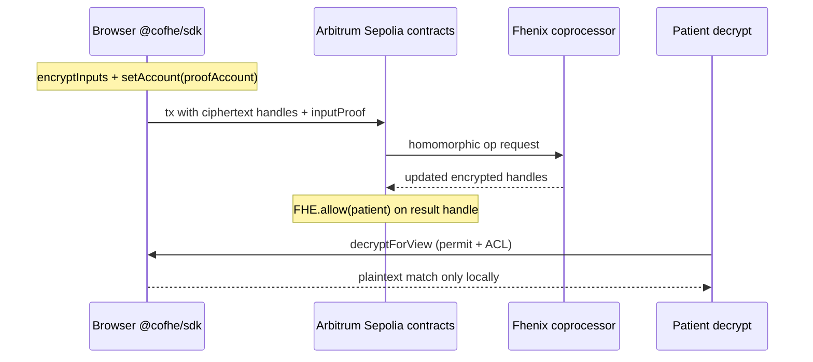
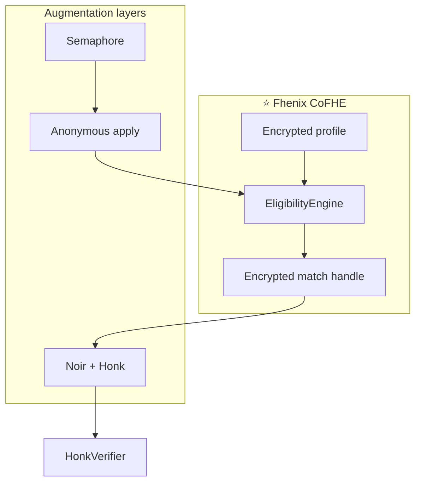
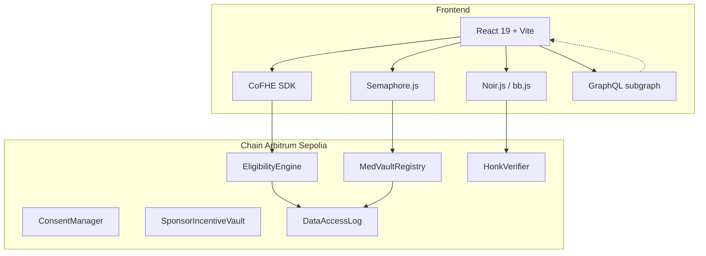

# MedVault — Private, FHE-Powered Clinical Trials

[](https://fhenix.io)
[](LICENSE)
[](docs/TEST_MATRIX.md)
[](https://sepolia.arbiscan.io/)

**MedVault** is built around **[Fhenix CoFHE](https://fhenix.io)** — confidential smart contracts on **Arbitrum Sepolia** where trial eligibility, consent, and incentives run on **encrypted health data**, not plaintext. Semaphore and Noir add anonymous identity and ZK binding; **Fhenix is the engine that makes private matching possible.**

**Live app:** deploy via [Vercel](https://vercel.com) (see [Deployment](#deployment)).  
**Repo:** [github.com/shery8595/Med-Vault](https://github.com/shery8595/Med-Vault)

---

## Table of contents

1. [Fhenix CoFHE — the core of MedVault](#fhenix-cofhe--the-core-of-medvault)
2. [What MedVault does](#what-medvault-does)
3. [Privacy stack: Semaphore & Noir](#privacy-stack-semaphore--noir)
4. [Architecture](#architecture)
5. [Smart contracts](#smart-contracts)
6. [Repository layout](#repository-layout)
7. [Getting started](#getting-started)
8. [Environment variables](#environment-variables)
9. [Testing](#testing)
10. [Noir circuit & Honk verifier](#noir-circuit--honk-verifier)
11. [Semaphore (anonymous trials)](#semaphore-anonymous-trials)
12. [The Graph subgraph](#the-graph-subgraph)
13. [Gasless relayer](#gasless-relayer)
14. [Deployment](#deployment)
15. [Documentation](#documentation)

---

## Fhenix CoFHE — the core of MedVault

> **Why Fhenix?** Clinical trials need *computation* on sensitive vitals (age, HbA1c, BMI, comorbidities) — not just hiding values in a vault. CoFHE lets sponsors define **encrypted inclusion criteria** and lets patients learn **encrypted match results** while validators and indexers never see plaintext PHI.

MedVault is a **reference dApp for Fhenix on Arbitrum Sepolia**: encrypted profiles, homomorphic eligibility scoring, encrypted consent gates, confidential incentive accounting, and local decrypt — all through the official CoFHE SDK and `FHE.sol` contracts.

### What runs on Fhenix in this repo

| MedVault capability | Fhenix primitive |
|---------------------|------------------|
| Medical vault (age, Hb, diabetes flag, …) | `euint8` / `euint16` + `InEuint*` + `inputProof` |
| Trial rubric vs encrypted profile | `FHE.ge`, `FHE.le`, `FHE.eq`, `FHE.cmux` in `EligibilityEngine` |
| Consent-aware eligibility | `ebool` + `EncryptedConsentGate` |
| Encrypted propensity / leaderboard signals | `EncryptedScoreLeaderboard` commits |
| Private balances & trial stakes | `euint64` in `ConfidentialETH` / vault flows |
| Patient views match outcome | ACL (`FHE.allow`) + `@cofhe/sdk` decrypt |

**Semaphore** hides *who* applied; **Noir** binds ZK claims to FHE outputs — but **every clinical comparison happens in Fhenix ciphertext space.**

### CoFHE architecture (four layers)



1. **Browser** — `@cofhe/sdk` encrypts vitals; proofs bound to a **proof account** (EOA or contract).
2. **EVM** — Stores handles; calls FHE precompiles; `FHE.allow` / `FHE.allowThis` ACL.
3. **Coprocessor** — Executes homomorphic math off-chain; chain keeps ciphertext.
4. **Decrypt** — Only ACL-approved paths; plaintext never written to chain state.

### Packages (pinned in `package.json`)

| Package | Role in MedVault |
|---------|------------------|
| [`@fhenixprotocol/cofhe-contracts`](https://www.npmjs.com/package/@fhenixprotocol/cofhe-contracts) | `FHE.sol`, `euint*`, `InEuint*`, `fromExternal` |
| [`@cofhe/sdk`](https://www.npmjs.com/package/@cofhe/sdk) | Browser: `encryptInputs`, `connect`, `decryptForView` |
| [`@cofhe/hardhat-plugin`](https://www.npmjs.com/package/@cofhe/hardhat-plugin) | Tests: `hre.cofhe.createClientWithBatteries`, mock decrypt |
| `@cofhe/sdk/chains` (`arbSepolia`) | Chain metadata + verifier URL |

### Frontend integration

- **Entry:** `src/lib/fhe.ts` — `connectFHE`, `encryptPatientProfile`, `decryptEligibility`, ephemeral `forceConnectFHE` for anonymous flows.
- **Wallet:** Privy → ethers signer → `Ethers6Adapter` on CoFHE client.
- **Verifier URL:** `/cofhe-vrf` → Fhenix testnet VRF (`testnet-cofhe-vrf.fhenix.zone`) via Vite dev proxy and `vercel.json` in production.
- **`useWorkers: false`** in dev — CoFHE workers cannot use the Vite proxy (avoids bad proofs / CORS).

```typescript
// Proof account MUST match msg.sender at the contract verify site
await client
  .encryptInputs([Encryptable.uint8(age), Encryptable.uint16(hbA1c)])
  .setAccount(proofAccount)  // e.g. MedVaultRegistry address for registerPatient
  .execute();
```

### Solidity contracts using FHE

| Contract | Fhenix usage |
|----------|----------------|
| `EligibilityEngine` | Core homomorphic trial matching |
| `MedVaultRegistry` / `AnonymousPatientRegistry` | Encrypted profile storage |
| `ConsentManager` / `EncryptedConsentGate` | Encrypted consent + gating |
| `EncryptedScoreLeaderboard` | Encrypted propensity commits |
| `ConfidentialETH` | Encrypted balances |
| `SponsorIncentiveVault` | FHE-aware payout paths where applicable |

### Local FHE development & CI

```bash
npm run compile          # Hardhat + CoFHE types
npm run test:unit        # 148 cases with @cofhe/hardhat-plugin mocks
```

Shared helpers: `test-support/fhe.ts` (`buildPatientProfileInputs`, `mockDecryptBool`).  
**#1 testnet pitfall:** wrong `setAccount` → `InvalidSigner` — see proof-account table in in-app **Docs → Fhenix & CoFHE**.

### Learn more

- In-app: **Docs → Fhenix & CoFHE** (`/docs/fhenix-cofhe`) and **FHE primitives** (`/docs/fhe-primitives`)
- Fhenix: [fhenix.io](https://fhenix.io) · CoFHE docs on the Fhenix developer hub

---

## What MedVault does

| Role | Capabilities |
|------|----------------|
| **Patient** | Register an encrypted medical profile (CoFHE), discover trials, apply with wallet or **anonymous Semaphore** identity, grant consent, decrypt eligibility locally, optional **Noir certify** (Honk proof on-chain). |
| **Sponsor** | Create protocols, fund incentive pools, review aggregate matches (no plaintext PHI), audit trail, milestone payouts via vault + Chainlink automation. |
| **Compliance** | `DataAccessLog` records anonymized hashes; consent scoped per `(patient, trial)`; Reclaim attestation optional on profile upload. |

Recent product areas: FHIR JSON prefill, sponsor representation monitoring, encrypted propensity signals (subgraph), fast audit log via `DetailedActionLogged` events, patient wallet gating when logged out.

---

## Privacy stack: Semaphore & Noir

**Fhenix CoFHE is the primary privacy layer** — see [Fhenix CoFHE — the core of MedVault](#fhenix-cofhe--the-core-of-medvault). Semaphore and Noir extend that foundation:



### Semaphore v4 (anonymous identity)

- **Purpose:** Apply to trials without linking the application to the patient’s main wallet on-chain.
- **Libraries:** `@semaphore-protocol/identity`, `group`, `proof`; on-chain `Semaphore` + `MedVaultRegistry`.
- **Flow:** Ephemeral identity in browser → Merkle proof → `AnonymousApplication` / staged apply → FHE eligibility with consent gate.
- **Code:** `src/lib/semaphore.ts`, `contracts/MedVaultRegistry.sol`, `contracts/AnonymousPatientRegistry.sol`.
- **Tests:** `test-support/semaphore.ts`, `MockSemaphore.sol`, integration tests `MVR-*`, `INT-EE-*`.

### Noir + Honk (ZK eligibility bind)

- **Circuit:** `circuits/eligibility_proof/` — proves Semaphore **nullifier** and **result hash** align with trial scope and eligibility bit (Poseidon, BN254).
- **Verifier:** `contracts/HonkVerifier.sol` generated with **Keccak transcript** (`evm-no-zk`) to match `@aztec/bb.js` in the browser.
- **Client:** `@noir-lang/noir_js` + bundled `eligibility_proof.json`; UI “Seal FHE result” / ZK certify step.
- **Tests:** `test/crypto/noir-nullifier.test.ts` (CI); `test/crypto/honk-pipeline.test.ts` (optional, slow).

| Layer | Role | Hides on-chain |
|-------|------|----------------|
| **Fhenix CoFHE** | **Encrypted compute + storage** | Plaintext vitals & criteria |
| Semaphore | Identity | Wallet ↔ application link |
| Noir | Proof binding | Forged eligibility vs Semaphore nullifier |

---

## Architecture



**Indexing:** The Graph (`subgraph/`) for trials, applications, consents, anonymous submissions, incentive pools — not for all audit data until `DataAccessLog` is deployed to Studio.

**Automation:** Chainlink Automation → `MedVaultAutomation` for milestone upkeep (not indexed by subgraph).

---

## Smart contracts

Deployed addresses: `src/lib/contracts/addresses.json` (`arbSepolia`).

| Contract | Role |
|----------|------|
| `MedVaultRegistry` | Patient registration, anonymous apply staging/finalize |
| `AnonymousPatientRegistry` | Commitment-based profiles + data access events |
| `EligibilityEngine` | FHE matching, applications, anonymous eligibility |
| `ConsentManager` / `EncryptedConsentGate` | Consent records + encrypted gate |
| `TrialManager` | Trial metadata lifecycle |
| `SponsorRegistry` | Sponsor verification |
| `SponsorIncentiveVault` | Trial incentive pools & payouts |
| `TrialMilestoneManager` | Milestone weights & completion |
| `MedVaultAutomation` | Chainlink `performUpkeep` |
| `DataAccessLog` | Immutable audit entries (`ActionLogged` / `DetailedActionLogged`) |
| `HonkVerifier` | Noir Honk proof verification |
| `ConfidentialETH` / `StakingManager` | Encrypted balances & Aave yield (where enabled) |
| `EncryptedScoreLeaderboard` | Encrypted propensity commits |

Compile: `npm run compile` · ABIs synced to frontend/subgraph: `npm run sync-abis`

---

## Repository layout

```
medvault/
├── contracts/              # Solidity 0.8.27 (FHE, Semaphore, Noir verifier)
├── circuits/eligibility_proof/  # Noir circuit (Nargo)
├── src/                    # React dApp (patient + sponsor portals)
├── subgraph/               # The Graph schema + mappings
├── relayer/                # Optional gasless finalize server
├── test/                   # Hardhat tests (see Testing)
├── test-support/           # deployMedVaultStack, FHE, Semaphore helpers
├── scripts/                # Deploy, circuit build, subgraph, wiring
└── docs/                   # TESTING_GUIDE, TEST_MATRIX, SUBGRAPH_SYNC, …
```

---

## Getting started

### Prerequisites

| Tool | Version / notes |
|------|-----------------|
| **Node.js** | 20+ (`engines` in `package.json`) |
| **npm** | 7+ |
| **Wallet** | Arbitrum Sepolia ETH (Privy in-app wallet supported) |
| **Noir (optional)** | WSL + `nargo` **1.0.0-beta.21** for `npm run build:circuit` |
| **Graph CLI (optional)** | For `subgraph:deploy` |

### Install & run frontend

```bash
git clone https://github.com/shery8595/Med-Vault.git
cd Med-Vault
npm install
cp .env.example .env.local   # fill VITE_PRIVY_APP_ID, VITE_SUBGRAPH_URL, etc.
npm run compile              # contracts (needed for typechain / some scripts)
npm run dev                  # http://localhost:3000
```

Vite proxies `/relay` → relayer when configured; CoFHE VRF via `/cofhe-vrf` in `vercel.json`.

---

## Environment variables

Copy `.env.example` → `.env.local` (never commit secrets).

| Variable | Purpose |
|----------|---------|
| `VITE_PRIVY_APP_ID` | Required — login / embedded wallet |
| `VITE_SUBGRAPH_URL` | The Graph Studio query URL (must match Playground) |
| `GRAPH_SUBGRAPH_SLUG` | Studio slug (e.g. `medvault-final`) |
| `VITE_RECLAIM_*` | Optional profile attestation (Reclaim Protocol) |
| `VITE_RECLAIM_ALLOW_SKIP` | `true` = skip Reclaim in dev |
| `VITE_RELAYER_URL` | Gasless finalize (default: same-origin `/relay`) |
| `VITE_TESTNET_FAUCET_URL` | Optional drip service for testnet ETH |
| `ARBITRUM_SEPOLIA_RPC_URL` | Hardhat / scripts |
| `PRIVATE_KEY` | Deploy scripts only — **never** commit |

Relayer (`relayer/.env.example`): `REGISTRY_ADDRESS`, `SEMAPHORE_ADDRESS`, `RELAYER_PRIVATE_KEY`, `RPC_URL`.

---

## Testing

MedVault uses **Hardhat 2**, **Mocha/Chai**, and **`@cofhe/hardhat-plugin`** (CoFHE mocks). Default CI run: **191 passing** (+ 1 optional Honk, 2 skipped).

| Suite | Cases | Command |
|-------|-------|---------|
| Smoke + unit + staking | 148 | `npm run test:unit` |
| Integration | 40 | `npm run test:integration` |
| Crypto (Noir nullifier alignment) | 3 | `npm run test:crypto` |
| Honk full pipeline (slow) | 1 | `npm run test:honk` |
| **Default** | **191** | `npm test` |

```bash
npm run compile
npm test
npm run test:coverage    # solidity-coverage
```

### Layout

```
test/
  smoke/           # deployMedVaultStack + CoFHE smoke (4)
  unit/            # Per-contract tests (~140)
  integration/     # Cross-contract + E2E (40)
  staking/         # StakingManager + MockAave (8)
  crypto/          # Noir nullifier + optional Honk

test-support/
  deployments.ts   # deployMedVaultStack()
  fhe.ts           # CoFHE 0.5 encrypt / mock decrypt
  semaphore.ts     # MockSemaphore proofs
  consent.ts       # grantConsent overload helpers
  signers.ts       # impersonateAccount
```

### CI

- **Contracts:** `.github/workflows/contracts-test.yml` — `compile` → `test:unit` → `test:integration` → `test:crypto` (Honk excluded).
- **Production app:** `.github/workflows/vercel-prebuilt.yml` — build on `main` push, `vercel deploy --prebuilt --prod`.

### In-app docs

Open the dApp → **Docs → Tests & verification** (`/docs/testing`) for overview, matrix, infrastructure, and CI mirrors.

**Deep dives:** [docs/TESTING_GUIDE.md](docs/TESTING_GUIDE.md) · [docs/TEST_MATRIX.md](docs/TEST_MATRIX.md)

---

## Noir circuit & Honk verifier

**Circuit:** `circuits/eligibility_proof/src/main.nr`

Public inputs: `scope` (trial id), `nullifier`, `result_hash`, `eligible`.  
Private: Semaphore `secret`, `scope_internal`, boolean eligibility.

**Build (WSL recommended on Windows):**

```bash
npm run build:circuit
# Runs scripts/compile-circuit.js → nargo compile + bb Keccak Honk →
#   circuits/eligibility_proof/target/eligibility_proof.json
#   contracts/HonkVerifier.sol
#   src/lib/circuits/eligibility_proof.json
```

**Redeploy verifier on testnet:**

```bash
npx hardhat compile
npx hardhat run scripts/deploy-verifier.ts --network arbitrumSepolia
# Wire engine: scripts in repo (e.g. finish-wiring.ts) as needed
```

After circuit or verifier changes: restart `npm run dev` and hard-refresh before **Seal FHE result**.

**Optional:** `npm run test:honk` after `build:circuit` (~3–5 min).

---

## Semaphore (anonymous trials)

1. **Identity** — `createIdentity()` / localStorage (`src/lib/semaphore.ts`).
2. **Group** — commitments from `MedVaultRegistry` `PatientRegistered` events.
3. **Proof** — `generateAnonymousProof()` for trial scope (trial id → scope field).
4. **On-chain** — `stageAnonymousApply` → FHE eligibility + consent → `finalize` (wallet or **relayer**).

**Ephemeral CoFHE permit:** Derived from identity secret so decryption keys stay off the main wallet.

**Nullifier storage:** Per-trial nullifiers in localStorage to prevent double-apply in the UI.

Contracts: `Semaphore` + `MedVaultRegistry` addresses in `addresses.json`.  
Tests: `test/integration/medvault-registry.test.ts`, `test/integration/eligibility-anonymous.test.ts`.

---

## The Graph subgraph

- **Schema:** `subgraph/schema.graphql` — `Trial`, `Application`, `Consent`, `AnonymousSubmission`, `IncentivePool`, `AuditLog`, …
- **Network:** `arbitrum-sepolia`
- **Config:** `subgraph/subgraph.yaml` — includes `DataAccessLog` → `ActionLogged` (redeploy required for audit entities in Studio)

```bash
npm run sync-abis
npm run subgraph:prepare          # codegen + build
npm run subgraph:deploy           # default label from package.json
# Or near head (smaller sync):
npm run subgraph:deploy:near-head -- 0.1.3
```

Set in frontend:

```env
VITE_SUBGRAPH_URL=https://api.studio.thegraph.com/query/<id>/medvault-final/<version>
```

**Audit logs in UI:** Hybrid — fast `DetailedActionLogged` `eth_getLogs` + subgraph trial scoping (`src/lib/auditLogFetch.ts`). Full subgraph-only audit needs a Studio deploy that indexes `DataAccessLog`.

**Ops guide:** [docs/SUBGRAPH_SYNC.md](docs/SUBGRAPH_SYNC.md)

---

## Gasless relayer

Optional service for **`finalizeAnonymousApplication`** when the patient should not pay gas.

```bash
cd relayer
cp .env.example .env
npm install
node server.js
```

Configure `VITE_RELAYER_URL` or use Vite dev proxy to `/relay`.  
Production example in `.env.example` (Railway).

---

## Deployment

### Frontend (Git → Vercel)

Push to **`main`** triggers GitHub Actions **Vercel prebuilt production** (requires secrets `VERCEL_TOKEN`, `VERCEL_ORG_ID`, `VERCEL_PROJECT_ID`).

```bash
git push origin main
```

Manual:

```bash
npm run vercel:ship
```

### Contracts (Arbitrum Sepolia)

```bash
# Examples — see scripts/ for full wiring
npx hardhat run scripts/deploy.ts --network arbitrumSepolia
npx hardhat run scripts/finish-wiring.ts --network arbitrumSepolia
npm run deploy:check-wiring:arb-sepolia
```

### Subgraph

```bash
npm run subgraph:deploy:near-head -- <version>
# Update VITE_SUBGRAPH_URL in Vercel env to the new Studio version URL
```

---

## Documentation

| Resource | Location |
|----------|----------|
| In-app docs (architecture, **Fhenix & CoFHE**, FHE primitives, Semaphore, Noir, compliance) | `/docs` in the dApp |
| Testing guide | [docs/TESTING_GUIDE.md](docs/TESTING_GUIDE.md) |
| Test matrix (case IDs) | [docs/TEST_MATRIX.md](docs/TEST_MATRIX.md) |
| Subgraph sync / versions | [docs/SUBGRAPH_SYNC.md](docs/SUBGRAPH_SYNC.md) |
| New contracts guide | [docs/NEW_CONTRACTS_GUIDE.md](docs/NEW_CONTRACTS_GUIDE.md) |
| Phased payouts & audit notes | [docs/UPGRADE_V1.1_PHASED_PAYOUTS_AND_AUDIT.md](docs/UPGRADE_V1.1_PHASED_PAYOUTS_AND_AUDIT.md) |
| Security audit report | [SECURITY_AUDIT_REPORT.md](SECURITY_AUDIT_REPORT.md) |

---

## Tech stack (summary)

| Area | Stack |
|------|--------|
| Frontend | React 19, Vite 6, Tailwind 4, Framer Motion, Privy, Tremor |
| Web3 | ethers v6, viem (via Privy), TypeChain |
| **Fhenix CoFHE** | **`@cofhe/sdk`, `@fhenixprotocol/cofhe-contracts`, `@cofhe/hardhat-plugin`** |
| ZK | Noir 1.0.0-beta.21, `@aztec/bb.js`, Semaphore 4.14 |
| Contracts | Solidity 0.8.27, Hardhat, Chainlink Automation |
| Indexing | The Graph (Apollo-style hooks via `useSubgraph`) |
| Hosting | Vercel (static + API rewrites) |

---

## License

BSD-3-Clause-Clear — see [LICENSE](LICENSE).

---

<div align="center">
Powered by Fhenix CoFHE — confidential clinical research on Arbitrum Sepolia
</div>
