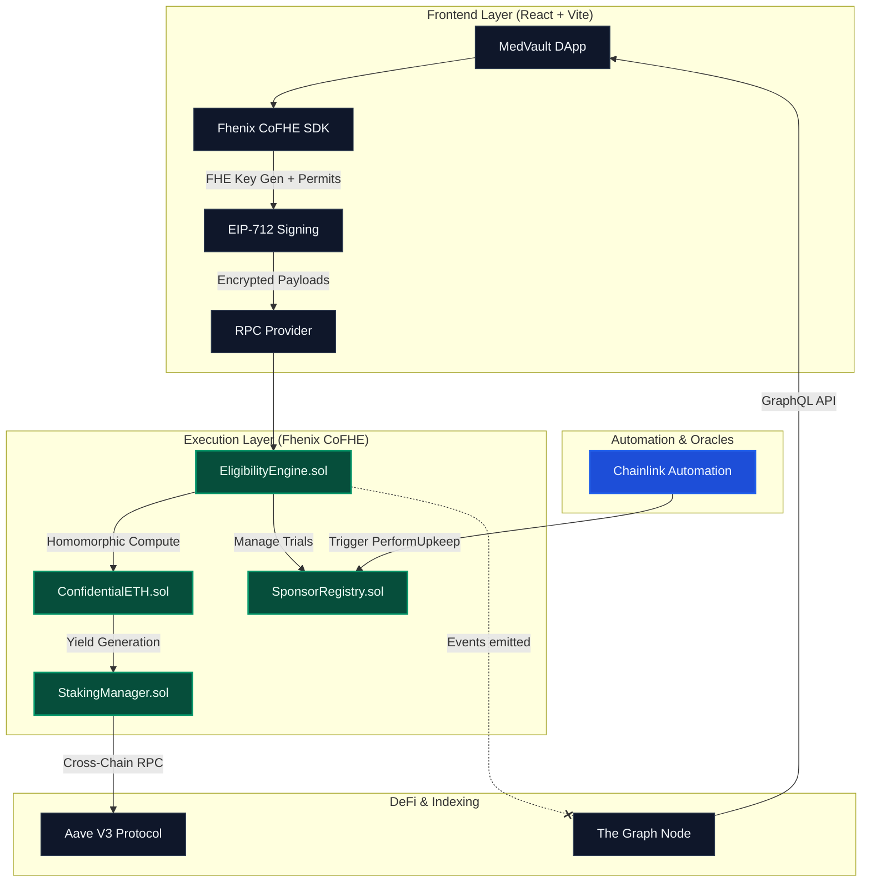
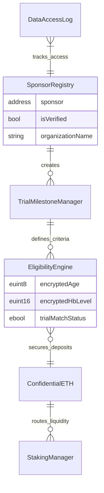
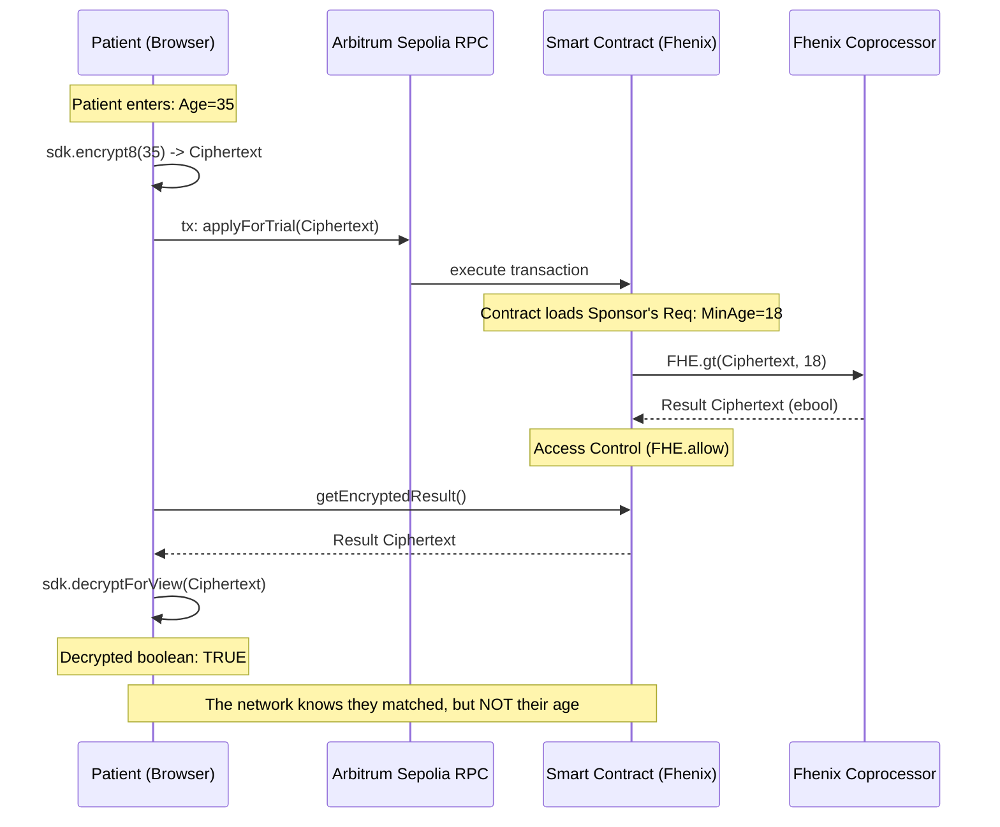
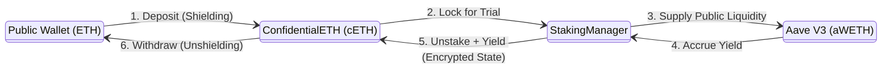
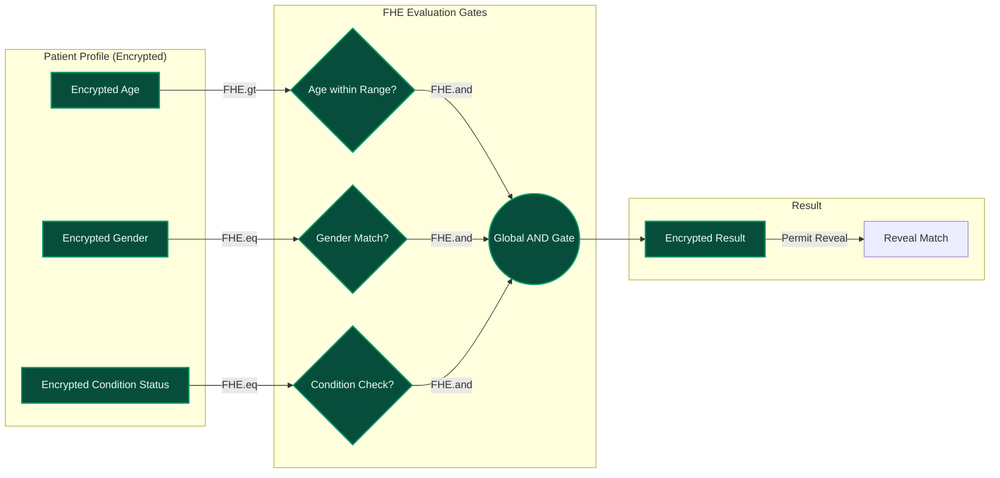
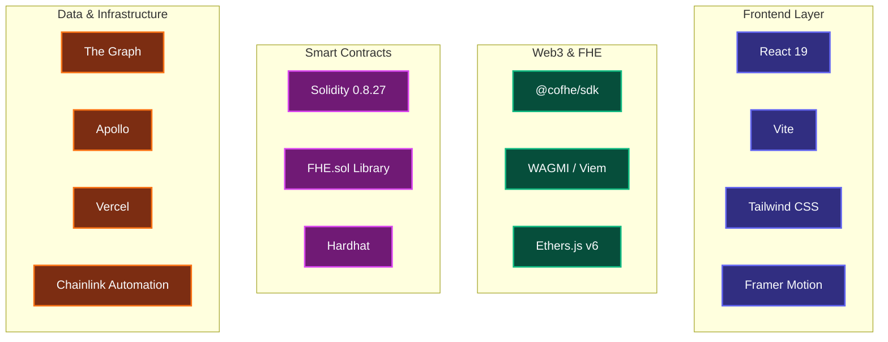

# MedVault — Private, FHE-Powered Clinical Trials

[](https://fhenix.io)
[](LICENSE)
[](docs/TESTING_GUIDE.md)
[](https://vercel.com)

**MedVault** is a decentralized clinical trial platform leveraging **Fully Homomorphic Encryption (FHE)** to bridge the gap between medical privacy and decentralized research. Built on **Fhenix (CoFHE)**, it allows patients to match with life-saving trials while keeping their medical data mathematically encrypted at all times on **Arbitrum Sepolia**.

---

## 🏗️ 1. Architecture Overview

MedVault uses a multi-layered approach to synchronize browser-level encryption with on-chain computation. The system ensures that patient data never exists in plaintext outside of the user's localized memory.



---

## 📜 2. Smart Contract Ecosystem

MedVault's core logic is distributed across a modular set of FHE-aware smart contracts. Each contract is designed to handle encrypted types (`euint8`, `euint16`, `ebool`) securely using the Fhenix `FHE.sol` library.



| Contract | Purpose | Key Feature |
|-----------|---------|-------------|
| **`EligibilityEngine.sol`** | Core Matching Logic | Homomorphic matching on `euint8`, `euint16`, and `ebool`. |
| **`ConfidentialETH.sol`** | Privacy Wrapper | 1e12 scaled `euint64` encrypted balances to prevent tracking. |
| **`StakingManager.sol`** | De-Fi Integration | Native Aave V3 yield generation on private assets. |
| **`PatientRegistry.sol`** | Patient Identity | Manages encrypted health profiles via Fhenix encrypted types. |
| **`SponsorRegistry.sol`** | Sponsor Identity | KYC & verification gates using off-chain encryption hashes. |
| **`SponsorIncentiveVault.sol`** | Reward Governance | Escrows and locks reward pools for phased trial distribution. |
| **`TrialManager.sol`** | Trial Lifecycle | Handles trial creation and public metadata for discovery. |
| **`TrialMilestoneManager.sol`**| Phased Delivery | Automated milestone-based progress tracking. |
| **`MedVaultAutomation.sol`** | Chainlink Upkeeps | Automates trial checkUpkeep and performUpkeep on Arbitrum Sepolia. |
| **`ConsentManager.sol`** | Selective Decryption | Manages patient approvals for FHE visibility. |
| **`DataAccessLog.sol`** | Compliance Audit | Immutable, anonymized HIPAA/GDPR access tracking. |

---

## 🔐 3. Fhenix CoFHE Encryption / Decryption Lifecycle

Fully Homomorphic Encryption allows the blockchain to do math on numbers it cannot see. MedVault utilizes the **@cofhe/sdk** and **FHE.sol**.



### The Cryptographic Guarantee:
1. **Client-side Encryption:** `@cofhe/sdk` handles secure encryption before data leaves the browser.
2. **On-Chain Computation:** The smart contract uses `FHE.add()`, `FHE.gt()`, etc., to manipulate ciphertexts via the Fhenix coprocessor.
3. **Access Control (Permits):** Only the intended recipient (e.g., the patient) can re-encrypt and view the final result using signed **Permits**.

---

## 💰 4. Private Staking & Yield

MedVault integrates with **Aave V3** to allow participants to earn yield on their confidential assets while they are locked in trials.



1. **Shielding:** Users deposit native ETH into `ConfidentialETH`, receiving an encrypted (`euint64`) balance.
2. **Staking:** The user commits encrypted funds to a trial. The `StakingManager` tracks the staked value privately.
3. **Yield Generation:** The `StakingManager` pools the underlying native ETH and supplies it to Aave V3 on Arbitrum.
4. **Unshielding:** Upon trial completion, the encrypted balance + yield is returned, and the user can unshield it back to their wallet.

---

## 🧬 5. Engine Trial Matching Workflow

The core value proposition of MedVault is the ability to evaluate a patient against a trial's criteria invisibly.



---

## 🧰 6. Tech Stack

MedVault is built using a modern, fully decentralized Web3 stack tailored for Fhenix CoFHE.



*   **Frontend UI:** React 19, Vite, Tailwind CSS, Lucide Icons, Framer Motion.
*   **Cryptography:** `@cofhe/sdk` for client-side encryption and permit management.
*   **Blockchain Dev:** `Hardhat` with `@cofhe/hardhat-plugin` for FHE-aware development.
*   **Smart Contracts:** Solidity `0.8.27` utilizing the `@fhenixprotocol/cofhe-contracts/FHE.sol` library.
*   **Data Indexing:** The Graph paired with Apollo Client for rapid UI rendering.
*   **Tooling:** TypeChain, Eslint, Prettier.

---

## ✅ Verification & Assurance

The system is verified by a **comprehensive stress test suite** that validates every edge case in the Fhenix CoFHE environment.

*   **Status**: All Tests Passing on Arbitrum Sepolia.
*   **Coverage**: Eligibility Engine, Staking Consistency, Reward Distribution, and Access Control (ACL).

```bash
# Run the verification suite
npx hardhat test test/comprehensive_medvault.test.js --network arbitrumSepolia
```

---

## 🚀 Getting Started

### Prerequisites
*   Node.js (v20+)
*   Metamask with **Arbitrum Sepolia** Testnet configured.

### Local Installation
1.  **Clone & Install**:
    ```bash
    git clone https://github.com/your-repo/medvault.git
    cd medvault
    npm install
    ```
2.  **Run Development Server**:
    ```bash
    npm run dev
    ```

### Vercel Deployment
MedVault is configured with `vercel.json` to handle the security headers required for FHE SDK execution.

---

## 📄 Documentation
For deep technical dives, check out the following guides:
*   [Testing & Verification Guide](docs/TESTING_GUIDE.md)
*   [New Contract Development Guide](docs/NEW_CONTRACTS_GUIDE.md)
*   [Upgrade Roadmap V1.1](docs/UPGRADE_V1.1_PHASED_PAYOUTS_AND_AUDIT.md)

---

<div align="center">
Built with ❤️ for the future of Medical Privacy on Fhenix.
</div>
