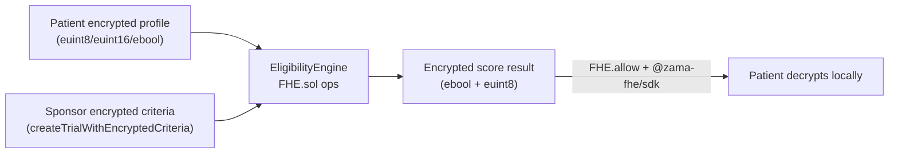
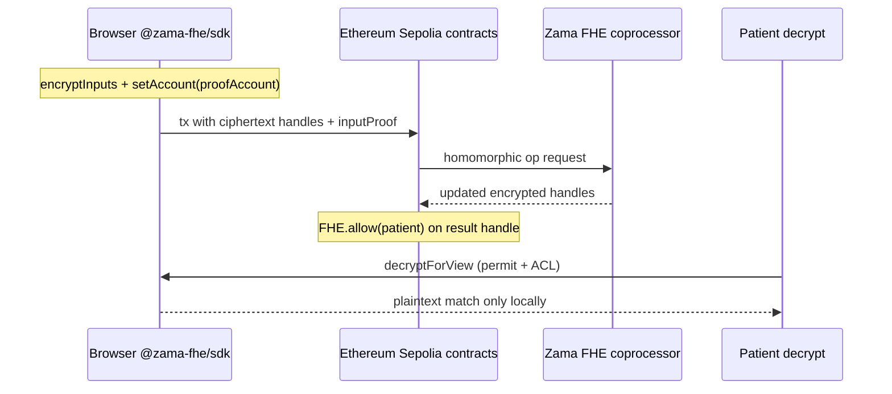

# MedVault — Private, FHE-Powered Clinical Trials

[](https://docs.zama.org)
[](LICENSE)
[](docs/TEST_MATRIX.md)
[](https://sepolia.etherscan.io/)
[](https://chain.link/automation)
[](https://www.npmjs.com/package/@medvault/sdk)

## Judges — start here

| Resource | Link |
|----------|------|
| **Live app** | [https://med-vault.xyz](https://med-vault.xyz) |
| **Demo video** | [YouTube walkthrough](https://www.youtube.com/watch?v=1wR01KflBOM&t=88s) |
| **Pitch deck outline** | [docs/PITCH_DECK.md](docs/PITCH_DECK.md) |
| **Lightpaper** | [docs/LIGHTPAPER.md](docs/LIGHTPAPER.md) |
| **FHE audit map** | [docs/FHE_AUDIT_README.md](docs/FHE_AUDIT_README.md) — primitive → contract → test |
| **Terminal demo** | `npm run demo:fhe` ([scripts/demo-fhe-lifecycle.mjs](scripts/demo-fhe-lifecycle.mjs)) |
| **Repo** | [github.com/shery8595/Med-Vault](https://github.com/shery8595/Med-Vault) |
| **SDK** | `npm install @medvault/sdk ethers@6.16.0` |

> **MedVault** homomorphically matches **encrypted patient vitals** against **encrypted sponsor trial criteria** on Ethereum Sepolia using **fhEVM** — with optional Semaphore anonymity and Noir identity/policy attestation (compliance seal). Sponsors encrypt inclusion bounds; patients encrypt vitals; validators and indexers never see plaintext PHI. *(Semaphore, Noir, Chainlink, subgraph, relayer, SDK, and Android extend the core FHE story — see [Appendix: platform depth](#appendix-platform-depth-optional-layers).)*

### What is encrypted vs public

| Data | On-chain |
|------|----------|
| Patient vitals (age, Hb, BMI, flags) | **Encrypted** (`euint8` / `euint16` / `ebool`) |
| Sponsor trial criteria (bounds, flags) | **Encrypted** via `createTrialWithEncryptedCriteria` |
| Eligibility result & propensity score | **Encrypted** (`ebool` / `euint8`) |
| Trial aggregate match stats | **Encrypted** (`euint64` sum + `euint32` count) |
| Trial name, phase, sponsor address | Public metadata |
| Native ETH `msg.value` on fund/deposit | Public at tx layer |

---

## Limitations & Trust Model

MedVault uses strong cryptography, but not every layer proves the same thing. This is an honest summary for integrators, sponsors, and patients.

| Layer | What it guarantees | What it does **not** guarantee |
|-------|-------------------|-------------------------------|
| **Zama FHE** (`EligibilityEngine._computeEligibility`) | Homomorphic matching on ciphertext — validators and indexers never see plaintext vitals during on-chain scoring | Off-chain PHI handling (IPFS documents, AI service, indexer caches); wallet linkage on non-relayer registration; L1 native ETH visibility at deposit/withdraw |
| **Noir + Honk** | **Identity and policy attestation** — Semaphore nullifier, profile commitment, staged FHE handle binding, encrypted-criteria echo binding | fhEVM homomorphic correctness; the compliance seal is **not** a proof that you passed eligibility — only that your witness matches your registered profile and staged handle |
| **Trusted relayer** | Gasless staging/finalize/cancel; **interim** re-decrypt of staged eligibility before finalize (P0.2) as defense-in-depth | Payout integrity is ciphertext-gated via `FHE.select` (P2, shipped — see P5-SELECT tests); relayer honesty is no longer the payout-integrity anchor |
| **Compliance posture** | Privacy-by-design for on-chain clinical matching | **Not HIPAA-compliant today** — off-chain PHI (IPFS, AI pre-screening, indexer), optional wallet linkage, and settlement-layer ETH visibility remain |

See [SECURITY.md](SECURITY.md), [docs/REGULATORY_POSTURE.md](docs/REGULATORY_POSTURE.md), [internal-docs/threat-model.md](internal-docs/threat-model.md), and in-app **Docs → Security Model** for residual risks and mitigations.

---

## Table of contents

1. [Zama FHE — the core of MedVault](#zama-fhe--the-core-of-medvault)
2. [What MedVault does](#what-medvault-does)
3. [How MedVault compares](#how-medvault-compares)
4. [Architecture](#architecture)
5. [Smart contracts](#smart-contracts)
6. [Repository layout](#repository-layout)
7. [Getting started](#getting-started)
8. [Environment variables](#environment-variables)
9. [Testing](#testing)
10. [TypeScript SDK](#typescript-sdk)
11. [Business model](#business-model)
12. [Deployment](#deployment)
13. [Documentation](#documentation)
14. [Tech stack (summary)](#tech-stack-summary)
15. [Appendix: platform depth (optional layers)](#appendix-platform-depth-optional-layers)

---

## Zama FHE — the core of MedVault

> **Why Zama?** Clinical trials need *computation* on sensitive vitals (age, HbA1c, BMI, comorbidities) — not just hiding values in a vault. Zama FHE lets sponsors define **encrypted inclusion criteria** and lets patients learn **encrypted match results** while validators and indexers never see plaintext PHI.

MedVault is a **reference dApp for Zama on Ethereum Sepolia**: encrypted profiles, homomorphic eligibility scoring, encrypted consent gates, confidential incentive accounting, and local decrypt — all through the official Zama SDK and `FHE.sol` contracts.

### What runs on Zama in this repo

Real logic from `EligibilityEngine._computeEligibility` — every operand is an encrypted handle; no plaintext ever loads on-chain:

```solidity
ebool ageOk = FHE.and(FHE.ge(patient.age, c.minAge), FHE.le(patient.age, c.maxAge));
ebool diabetesOk = FHE.eq(patient.hasDiabetes, FHE.asEbool(true));
ebool eligible = FHE.and(ageOk, diabetesOk);   // computed entirely on ciphertext
```

| MedVault capability | Zama primitive |
|---------------------|------------------|
| Medical vault (age, Hb, diabetes flag, …) | `euint8` / `euint16` + `InEuint*` + `inputProof` |
| **Encrypted sponsor criteria** | `createTrialWithEncryptedCriteria` — sponsor bounds hidden on-chain |
| Trial rubric vs encrypted profile | `FHE.ge`, `FHE.le`, `FHE.eq`, `FHE.select` in `EligibilityEngine` |
| **Batch eligibility** | `checkEligibilityBatch` — N trials in one authorized call |
| **Encrypted aggregates** | `FHE.add` on scores/counts in `EncryptedScoreLeaderboard` |
| Consent-aware eligibility | `ebool` + `EncryptedConsentGate` |
| Encrypted propensity / leaderboard signals | `EncryptedScoreLeaderboard` commits |
| Private balances & trial stakes | `euint64` in `ConfidentialETH` / vault flows |
| Patient views match outcome | ACL (`FHE.allow`) + `@zama-fhe/sdk` decrypt |

**Semaphore** hides *who* applied; **Noir** seals a public compliance receipt bound to the Zama FHE stage — but **every clinical comparison happens in Zama ciphertext space.**

### Zama FHE architecture (four layers)

Data never exists in plaintext on-chain; only ACL-approved patients decrypt the final match.





1. **Browser** — `@zama-fhe/sdk` encrypts vitals; proofs bound to a **proof account** (EOA or contract).
2. **EVM** — Stores handles; calls FHE precompiles; `FHE.allow` / `FHE.allowThis` ACL.
3. **Coprocessor** — Executes homomorphic math off-chain; chain keeps ciphertext.
4. **Decrypt** — Only ACL-approved paths; plaintext never written to chain state.

### Packages (pinned in `package.json`)

| Package | Role in MedVault |
|---------|------------------|
| [`@fhevm/solidity`](https://www.npmjs.com/package/@fhevm/solidity) | `FHE.sol`, `euint*`, `InEuint*`, `fromExternal` |
| [`@zama-fhe/sdk`](https://www.npmjs.com/package/@zama-fhe/sdk) | Browser: `encryptInputs`, `connect`, `decryptForView` |
| [`@fhevm/hardhat-plugin`](https://www.npmjs.com/package/@fhevm/hardhat-plugin) | Tests: `hre.fhevm.createClientWithBatteries`, mock decrypt |
| `@zama-fhe/sdk/chains` (`sepolia`) | Chain metadata + verifier URL |

### Frontend integration

- **Entry:** `src/lib/fhe.ts` — `ensureZamaConnected`, `encryptPatientProfile`, `decryptEligibility`, ephemeral `forceConnectFHE` for anonymous flows.
- **Wallet:** Privy → ethers signer → `Ethers6Adapter` on Zama SDK client.
- **Verifier URL:** `/api/relayer` → Ethereum Sepolia testnet VRF (`relayer.testnet.zama.org`) via Vite dev proxy and `vercel.json` in production.
- **`useWorkers: false`** in dev — Zama FHE workers cannot use the Vite proxy (avoids bad proofs / CORS).

```typescript
// Proof account MUST match msg.sender at the contract verify site
await client
  .encryptInputs([Encryptable.uint8(age), Encryptable.uint16(hbA1c)])
  .setAccount(proofAccount)  // e.g. MedVaultRegistry address for registerPatient
  .execute();
```

### Solidity contracts using FHE

| Contract | Zama usage |
|----------|----------------|
| `EligibilityEngine` | Core homomorphic trial matching |
| `MedVaultRegistry` / `AnonymousPatientRegistry` | Encrypted profile storage |
| `ConsentManager` / `EncryptedConsentGate` | Encrypted consent + gating |
| `EncryptedScoreLeaderboard` | Encrypted propensity commits |
| `ConfidentialETH` | Encrypted balances |
| `SponsorIncentiveVault` | FHE-aware payout paths where applicable |

### Local FHE development & CI

```bash
npm run compile          # Hardhat + Zama FHE types
npm run test:unit        # 395 passing (+ 6 pending) with @fhevm/hardhat-plugin mocks (see testSuiteData.ts)
```

Shared helpers: `test-support/fhe.ts` (`buildPatientProfileInputs`, `mockDecryptBool`).  
**#1 testnet pitfall:** wrong `setAccount` → `InvalidSigner` — see proof-account table in in-app **Docs → Zama FHE**.

### Learn more

- In-app: **Docs → Zama FHE** (`/docs/zama-fhe`) and **FHE primitives** (`/docs/fhe-primitives`)
- Zama: [docs.zama.org](https://docs.zama.org) · Zama FHE docs on the Zama developer hub

---

## What MedVault does

| Role | Capabilities |
|------|----------------|
| **Patient** | Register an encrypted medical profile (Zama FHE), discover trials, apply with wallet or **anonymous Semaphore** identity, grant consent, decrypt eligibility locally, optional **identity and policy attestation** (Noir compliance seal bound to the Zama FHE stage — not a proof of fhEVM execution). |
| **Sponsor** | Create protocols (encrypted criteria via FHE), fund incentive pools, **upload protocol PDF → AI-extracted encrypted criteria**, review aggregate matches (no plaintext PHI), audit trail, milestone payouts via vault + Chainlink automation. |
| **Compliance** | `DataAccessLog` records anonymized hashes; consent scoped per `(patient, trial)`; Reclaim attestation optional on profile upload. |

Recent product areas: FHIR JSON prefill, sponsor representation monitoring, encrypted propensity signals (subgraph), fast audit log via `DetailedActionLogged` events, patient wallet gating when logged out.

---

## How MedVault compares

MedVault closes three gaps common in Zama/FHE hackathon repos (Circux, Covalent parity):

| Capability | MedVault |
|------------|----------|
| **Confidential token standard** | `ConfidentialETH7984` subclasses OpenZeppelin **ERC-7984** (`@openzeppelin/confidential-contracts ^0.5.1`) while preserving native-ETH deposit, multi-phase withdraw, EIP-712 public exit, and KMS-gated `transferEncrypted`. See [docs/FHE_AUDIT_README.md — ERC-7984 conformance](docs/FHE_AUDIT_README.md). |
| **One-command local setup** | `docker compose up --build` → frontend on `:3000` against Sepolia; optional `--profile relayer` and `--profile graph`. See [docs/LOCAL_DEVELOPMENT.md](docs/LOCAL_DEVELOPMENT.md). |
| **Formal internal docs** | SRS, DFD, threat model, Zama integration guide, architecture in [internal-docs/](internal-docs/README.md). |

---

## Architecture

```mermaid
graph TD
  subgraph Frontend
    A[React 19 + Vite] --> B[@zama-fhe/sdk]
    A --> S[Semaphore.js]
    A --> N[Noir.js / bb.js]
    A --> G[GraphQL subgraph]
  end
  subgraph Chain["Ethereum Sepolia — no upgrade proxies"]
    subgraph FHE["ZamaEthereumConfig base"]
      TM[TrialManager]
      MVR[MedVaultRegistry]
      APR[AnonymousPatientRegistry]
      EE[EligibilityEngine]
      CM[ConsentManager]
      ECG[EncryptedConsentGate]
      ESL[EncryptedScoreLeaderboard]
      PDS[PatientDocumentStore]
      SR[SponsorRegistry]
    end
    subgraph Finance["ERC7984 + EIP712"]
      CET[ConfidentialETH7984]
      CE[ConfidentialETH alias]
      SM[StakingManager]
      SIV[SponsorIncentiveVault]
    end
    subgraph Ops["Automation & audit"]
      TMM[TrialMilestoneManager]
      MVA[MedVaultAutomation]
      DAL[DataAccessLog]
    end
    subgraph ZK["Honk abstract base"]
      HV[HonkVerifier]
    end
  end
  B --> EE
  S --> MVR
  N --> HV
  G -.-> A
  MVR --> APR
  MVR --> EE
  EE --> APR
  EE --> TM
  EE --> CM
  EE --> ECG
  EE --> PDS
  EE --> HV
  SIV --> CET
  SM --> CET
  MVA --> SIV
  MVR --> DAL
  EE --> DAL
  CE -.->|inherits| CET
```

**Indexing:** The Graph (`subgraph/`) for trials, applications, consents, anonymous submissions, incentive pools — not for all audit data until `DataAccessLog` is deployed to Studio.

**Automation:** [Chainlink Automation](#chainlink-automation) (appendix) finalizes expired trials via `MedVaultAutomation` (not indexed by subgraph).

---

## Smart contracts

**17 production Solidity files** (15 protocol + `HonkVerifier` + `ConfidentialETH` deploy alias). Canonical catalog: `src/lib/protocolContracts.ts` · in-app reference: `/docs/contracts`.

Deployed addresses: `src/lib/contracts/addresses.json` (`sepolia`).

| # | Contract | Role |
|---|----------|------|
| 01 | `TrialManager.sol` | Trial lifecycle; public metadata + encrypted criteria via `createTrialWithEncryptedCriteria` |
| 02 | `MedVaultRegistry.sol` | Patient registration, Semaphore bridge, anonymous apply staging/finalize |
| 03 | `AnonymousPatientRegistry.sol` | Commitment-keyed encrypted profiles + data access events |
| 04 | `EligibilityEngine.sol` | FHE matching, applications, anonymous eligibility, document hooks |
| 05 | `ConsentManager.sol` | Per-trial encrypted consent ACL |
| 06 | `SponsorRegistry.sol` | Sponsor verification allowlist |
| 07 | `EncryptedConsentGate.sol` | Consent + eligibility encrypted gate |
| 08 | `EncryptedScoreLeaderboard.sol` | Encrypted propensity commits & aggregates |
| 09 | `SponsorIncentiveVault.sol` | Trial incentive pools, claims, phased payouts |
| 10 | `TrialMilestoneManager.sol` | Milestone weights & completion |
| 11 | `StakingManager.sol` | Public Aave stake + confidential cETH stake/unstake |
| 12 | `ConfidentialETH7984.sol` | **IERC7984** canonical implementation — encrypted balances, deposit, withdraw/exit, EIP-712 |
| 13 | `ConfidentialETH.sol` | **Deploy alias** — `contract ConfidentialETH is ConfidentialETH7984 {}` |
| 14 | `MedVaultAutomation.sol` | Chainlink Automation — trial expiry finalization |
| 15 | `DataAccessLog.sol` | Immutable audit entries (`ActionLogged` / `DetailedActionLogged`) |
| 16 | `PatientDocumentStore.sol` | Hybrid IPFS CID + FHE-wrapped AES document keys |
| 17 | `HonkVerifier.sol` | Noir Honk — plaintext criteria attestation (`eligibilityVerifier`) |
| 18 | `HonkVerifierEncrypted.sol` | Noir Honk — encrypted criteria attestation (`eligibilityVerifierEncrypted`) |

Compile: `npm run compile` · ABIs synced to frontend/subgraph: `npm run sync-abis` · Deeper docs: [docs/README.md](docs/README.md) · `/docs/contracts`

---

## Repository layout

### Monorepo map

| Area | Path | npm workspace? |
|------|------|----------------|
| **Frontend** (root app `medvault-zama`) | `src/`, `android/`, `capacitor.config.ts` | No — root package |
| **Core library** | `packages/medvault-core/` | Yes (`@medvault/core`) |
| **Integrator SDK** | `packages/medvault-sdk/` | Yes (`@medvault/sdk`) |
| **MCP server** | `mcp-server/` | Yes (`@medvault/mcp-server`) |
| **Indexer API** | `indexer/` | Yes (`@medvault/indexer`) |
| **AI service** | `ai-service/` | Yes (`@medvault/ai`) |
| **Gasless relayer** | `relayer/` | Standalone |
| **Subgraph** | `subgraph/` | Standalone |
| **Sepolia faucet** | `sepolia-faucet/` | Standalone |

> **Not product features** — empty or stub directories (`faucet-server/`, `New Frontend Reference/`, `src/components/applications/`, `src/styles/`) are not referenced in docs or CI.

```
medvault/
├── contracts/              # 17 production Solidity files (FHE, Semaphore, Noir verifier)
├── circuits/
│   ├── eligibility_plaintext/   # Noir — plaintext criteria attestation (25 public inputs)
│   └── eligibility_encrypted/   # Noir — encrypted criteria binding (15 public inputs)
├── src/                    # React dApp (patient + sponsor portals) — root frontend
├── android/                # Capacitor Android project (demo APK)
├── packages/
│   ├── medvault-core/      # Protocol helpers (contracts, subgraph, sponsor ops)
│   └── medvault-sdk/       # @medvault/sdk — integrator facade
├── mcp-server/             # Local MCP server (stdio + optional HTTP)
├── indexer/                # Mongo/Redis indexer API (optional Docker profile)
├── ai-service/             # Sponsor criteria extraction + log audit API
├── relayer/                # Optional gasless finalize server (standalone)
├── subgraph/               # The Graph schema + mappings (standalone)
├── sepolia-faucet/         # Testnet ETH drip helper (standalone)
├── config/mcp/             # MCP client config snippets (Cursor, Codex, …)
├── test/                   # Hardhat tests (see Testing)
├── test-support/           # deployMedVaultStack, FHE, Semaphore helpers
├── scripts/                # Deploy, circuit build, subgraph, wiring
├── docs/                   # Markdown guides (index: docs/README.md)
└── internal-docs/          # SRS, DFD, threat model (engineering specs)
```

---

## Getting started

### Prerequisites

| Tool | Version / notes |
|------|-----------------|
| **Node.js** | 20+ (`engines` in `package.json`) |
| **npm** | 7+ |
| **Wallet** | Ethereum Sepolia ETH (Privy in-app wallet supported) |
| **Noir (optional)** | WSL + `nargo` **1.0.0-beta.21** for `npm run build:circuit` |
| **Graph CLI (optional)** | For `subgraph:deploy` |

### Install & run frontend

```bash
git clone https://github.com/shery8595/Med-Vault.git
cd Med-Vault
npm install
cp .env.example .env.local   # fill VITE_PRIVY_APP_ID, VITE_SUBGRAPH_URL, etc.
npm run compile              # contracts (needed for typechain / some scripts)
npm run dev                  # http://localhost:3000
```

### Docker Compose (one command)

```bash
cp .env.docker.example .env.local   # set VITE_PRIVY_APP_ID
docker compose up --build           # http://localhost:3000
```

Optional: `--profile relayer` (local HTTP relayer), `--profile graph` (local Graph Node), `--profile indexer` (Mongo/Redis + indexer API). See [docs/LOCAL_DEVELOPMENT.md](docs/LOCAL_DEVELOPMENT.md).

### Internal documentation

Formal SRS, DFD, threat model, and Zama integration guide: [internal-docs/](internal-docs/README.md).

Vite proxies `/relay` → relayer when configured; Zama FHE VRF via `/api/relayer` in `vercel.json`.

---

## Environment variables

Copy `.env.example` → `.env.local` (never commit secrets).

| Variable | Purpose |
|----------|---------|
| `VITE_PRIVY_APP_ID` | Required — login / embedded wallet |
| `VITE_SUBGRAPH_URL` | The Graph Studio query URL (must match Playground) |
| `GRAPH_SUBGRAPH_SLUG` | Studio slug — canonical: `medvault` (see `.env.example`) |
| `VITE_RECLAIM_*` | Optional profile attestation (Reclaim Protocol) |
| `VITE_RECLAIM_ALLOW_SKIP` | `true` = skip Reclaim in dev |
| `VITE_RELAYER_URL` | Gasless finalize (default: same-origin `/relay`) |
| `VITE_TESTNET_FAUCET_URL` | Optional drip service for testnet ETH |
| `SEPOLIA_RPC_URL` | Hardhat / scripts |
| `PRIVATE_KEY` | Deploy scripts only — **never** commit |

**MCP server** (local IDE only — see [Appendix: MCP server](#mcp-server-ai-tools)): `MEDVAULT_SUBGRAPH_URL`, `MCP_PRIVATE_KEY`, optional `MEDVAULT_SPONSOR_OPEN_ACCESS`, `MCP_MAX_ETH_PER_TX`. Documented in `.env.example`; not required for the web app.

Relayer (`relayer/.env.example`): `REGISTRY_ADDRESS`, `SEMAPHORE_ADDRESS`, `RELAYER_PRIVATE_KEY`, `RPC_URL`, optional batch exit `MIN_BATCH_SIZE` / `MAX_WAIT_MS`. Authorize relayer on `ConfidentialETH` for withdraw completion helpers.

Private withdrawals: see [docs/PRIVATE_WITHDRAWALS.md](docs/PRIVATE_WITHDRAWALS.md) and in-app `/docs/private-withdrawals`.

---

## Testing

MedVault uses **Hardhat 2**, **Mocha/Chai**, and **`@fhevm/hardhat-plugin`** (Zama FHE mocks).

> **Canonical counts** — sourced from [`src/lib/docsStats.ts`](src/lib/docsStats.ts) and [`src/pages/docs/testing/testSuiteData.ts`](src/pages/docs/testing/testSuiteData.ts) (methodology in [`docs/AUDIT.md`](docs/AUDIT.md)).

Default CI run: **483 passing** (+ 6 pending, 1 optional Honk). Full registered matrix: **~2,020** cases across **96** test files (incl. **832** parametric fuzz expansions).

| Suite | Cases | Command |
|-------|-------|---------|
| Smoke + unit + staking | 395 | `npm run test:unit` |
| Integration | 85 | `npm run test:integration` |
| Crypto (Noir nullifier alignment) | 3 | `npm run test:crypto` |
| Honk full pipeline (slow) | 1 | `npm run test:honk` |
| **Default** | **483** | `npm test` |

```bash
npm run compile
npm test
npm run test:coverage    # solidity-coverage
```

### Layout

```
test/
  smoke/           # deployMedVaultStack + Zama FHE smoke (4)
  unit/            # Per-contract tests (59 files; incl. timelock-wiring TL-*, sponsor-registry-auditor SRA-*)
  integration/     # Cross-contract + E2E (14 files)
  staking/         # StakingManager + MockAave (8)
  crypto/          # Noir nullifier + optional Honk

test-support/
  deployments.ts   # deployMedVaultStack()
  fhe.ts           # Zama FHE encrypt / mock decrypt
  semaphore.ts     # MockSemaphore proofs
  consent.ts       # grantConsent overload helpers
  signers.ts       # impersonateAccount
```

### CI

Four GitHub Actions workflows (see `docsStats.ts` → `ciWorkflows`):

- **Contracts:** `.github/workflows/contracts-test.yml` — `compile` → `test:unit` → `test:integration` → `test:crypto` (Honk excluded).
- **Frontend:** `.github/workflows/frontend.yml` — Vite build + unit tests.
- **Docker smoke:** `.github/workflows/docker-smoke.yml` — Compose frontend health check.
- **MCP/SDK:** `.github/workflows/mcp.yml` — core + SDK + MCP server build.

### In-app docs

Open the dApp → **Docs → Tests & verification** (`/docs/testing`) for overview, matrix, infrastructure, and CI mirrors.

**Deep dives:** [docs/TESTING_GUIDE.md](docs/TESTING_GUIDE.md) · [docs/TEST_MATRIX.md](docs/TEST_MATRIX.md)

---

## TypeScript SDK

**`@medvault/sdk`** — published TypeScript library for integrators and scripts. Wraps `@medvault/core` with `MedVaultSDK.create()` and modules for trials, sponsor ops, protocol metadata, and relayer HTTP.

```bash
npm install @medvault/sdk ethers@6.16.0
```

| Item | Location |
|------|----------|
| Package | `packages/medvault-sdk/` · [npm](https://www.npmjs.com/package/@medvault/sdk) |
| Package README | [packages/medvault-sdk/README.md](packages/medvault-sdk/README.md) |
| In-app docs | [/docs/mcp/sdk](https://med-vault.xyz/docs/mcp/sdk) |

```bash
npm run sdk:build
npm run sdk:test

# After contract / ABI updates:
npm run sync-sdk-assets
```

```typescript
import { MedVaultSDK } from "@medvault/sdk";

const sdk = MedVaultSDK.create({
  subgraphUrl: process.env.MEDVAULT_SUBGRAPH_URL!,
  relayerUrl: process.env.MEDVAULT_RELAYER_URL,
});

await sdk.trials.listActive({ first: 10 });
await sdk.relayer.health();
```

**v1 scope:** subgraph reads, sponsor writes (with `signer`), `sdk.relayer.*` for gasless anonymous apply. Patient FHE / Semaphore / Noir stay in the browser dApp.

---

## Business model

MedVault has **no token**. Revenue is service + protocol fees on real clinical-trial workflows (projections below are illustrative, not guarantees):

| Stream | Model | Notes |
|--------|-------|-------|
| **Sponsor SaaS** | Per-trial creation + verification fee | Verified sponsors on `SponsorRegistry`; KYC on mainnet |
| **Protocol fee** | % on `SponsorIncentiveVault` distributions | Framed at escrow settlement — not yet enforced on-chain in v0.1 |
| **Enterprise** | Private trial deployments + SLA | Dedicated relayer/indexer, custom subgraph |

**2026 projections (illustrative):**

| Scenario | Sponsor SaaS | Protocol fees | Enterprise | Total |
|----------|-------------|---------------|------------|-------|
| Conservative | $12K | $5K | $0 | **$17K** |
| Base | $45K | $25K | $30K | **$100K** |
| Optimistic | $120K | $80K | $100K | **$300K** |

See [docs/LIGHTPAPER.md](docs/LIGHTPAPER.md) for the full business model and roadmap.

---

## Deployment

Production is served at **https://med-vault.xyz** (configure the custom domain in the Vercel project). Set the relayer’s `FRONTEND_URL` to that origin for CORS.

### Frontend (Git → Vercel)

Push to **`main`** triggers GitHub Actions **Vercel prebuilt production** (requires secrets `VERCEL_TOKEN`, `VERCEL_ORG_ID`, `VERCEL_PROJECT_ID`).

```bash
git push origin main
```

Manual:

```bash
npm run vercel:ship
```

### Contracts (Ethereum Sepolia)

```bash
# Deploy + schedule timelock wiring
npm run deploy:sepolia
npm run deploy:wire:sepolia          # if wiring incomplete

# After ~6 hours
npm run deploy:wiring:sepolia
npm run deploy:check-wiring:sepolia
```

### Chainlink Automation

After deploy, register upkeep in the Chainlink UI and set the forwarder:

```bash
CHAINLINK_FORWARDER=0x... npm run deploy:chainlink-forwarder:sepolia
```

See [Chainlink Automation](#chainlink-automation) in the appendix and `scripts/diagnose-automation-upkeep.ts`.

### Subgraph

```bash
npm run subgraph:deploy:near-head -- <version>
# Update VITE_SUBGRAPH_URL in Vercel env to the new Studio version URL
```

### Android demo APK (Capacitor)

Internal sideload APK for demos — same React dapp in a WebView.

```bash
# Android Studio (recommended):
npm run mobile:studio
# → Run ▶ or Build → Build APK(s)

# CLI:
npm run mobile:apk:debug
# → android/app/build/outputs/apk/debug/app-debug.apk
```

**Ops:** add `https://localhost` to Privy allowed origins and relayer `FRONTEND_URL` (comma-separated with production). Create `android/local.properties` with your SDK path; Gradle needs **JDK 21**.

See [docs/ANDROID_APK.md](docs/ANDROID_APK.md) and in-app [/docs/mobile/android-apk](https://med-vault.xyz/docs/mobile/android-apk).

---

## Documentation

See also [docs/README.md](docs/README.md) for the full index.

| Resource | Location |
|----------|----------|
| **Doc index** | [docs/README.md](docs/README.md) |
| **Regulatory posture** | [docs/REGULATORY_POSTURE.md](docs/REGULATORY_POSTURE.md) — HIPAA/IRB/GDPR scope boundaries |
| **External security audit** | [docs/EXTERNAL_AUDIT_SUMMARY.md](docs/EXTERNAL_AUDIT_SUMMARY.md) · [docs/EXTERNAL_AUDIT_SCOPE.md](docs/EXTERNAL_AUDIT_SCOPE.md) |
| **Audit baseline** | [docs/AUDIT.md](docs/AUDIT.md) · `src/lib/docsStats.ts` |
| **Local dev & Docker** | [docs/LOCAL_DEVELOPMENT.md](docs/LOCAL_DEVELOPMENT.md) · [docs/DOCKER.md](docs/DOCKER.md) |
| **Hybrid document storage** | [docs/HYBRID_STORAGE.md](docs/HYBRID_STORAGE.md) |
| **Atomic flows** | [docs/ATOMIC_FLOWS.md](docs/ATOMIC_FLOWS.md) |
| **Zero-revelation rewards** | [docs/ZERO_REVELATION_REWARDS.md](docs/ZERO_REVELATION_REWARDS.md) |
| **IERC7984 cETH** | [docs/ERC7984_CONFIDENTIAL_TOKEN.md](docs/ERC7984_CONFIDENTIAL_TOKEN.md) · [docs/FHE_AUDIT_README.md](docs/FHE_AUDIT_README.md) |
| **Internal specs (SRS, DFD)** | [internal-docs/](internal-docs/README.md) |
| In-app docs (architecture, **Zama FHE**, FHE primitives, Semaphore, Noir, **Chainlink Automation**, compliance) | `/docs` in the dApp |
| **TypeScript SDK** | [/docs/mcp/sdk](https://med-vault.xyz/docs/mcp/sdk) · [packages/medvault-sdk/README.md](packages/medvault-sdk/README.md) |
| **MCP server (AI tools)** | [/docs/mcp](https://med-vault.xyz/docs/mcp) · [docs/MCP_SERVER.md](docs/MCP_SERVER.md) |
| Testing guide | [docs/TESTING_GUIDE.md](docs/TESTING_GUIDE.md) |
| Test matrix (case IDs) | [docs/TEST_MATRIX.md](docs/TEST_MATRIX.md) |
| Timelock wiring (deploy) | [docs/TIMELOCK_WIRING.md](docs/TIMELOCK_WIRING.md) · `/docs/timelock-wiring` |
| Private withdrawals | [docs/PRIVATE_WITHDRAWALS.md](docs/PRIVATE_WITHDRAWALS.md) · `/docs/private-withdrawals` |
| Verification snapshot | [docs/VERIFICATION_SNAPSHOT.md](docs/VERIFICATION_SNAPSHOT.md) |
| Subgraph sync / versions | [docs/SUBGRAPH_SYNC.md](docs/SUBGRAPH_SYNC.md) |
| **Android demo APK** | [/docs/mobile/android-apk](https://med-vault.xyz/docs/mobile/android-apk) · [docs/ANDROID_APK.md](docs/ANDROID_APK.md) · [docs/MOBILE_ARCHITECTURE.md](docs/MOBILE_ARCHITECTURE.md) |
| Archived design proposals | [docs/archive/](docs/archive/) (historical — contracts shipped) |

---

## Tech stack (summary)

| Area | Stack |
|------|--------|
| Frontend | React 19, Vite 6, Tailwind 4, Framer Motion, Privy, Tremor |
| Web3 | ethers v6, viem (via Privy), TypeChain |
| **Zama FHE** | **`@zama-fhe/sdk`, `@fhevm/solidity`, `@fhevm/hardhat-plugin`** |
| ZK | Noir 1.0.0-beta.21, `@aztec/bb.js`, Semaphore 4.14 |
| **Chainlink** | **Automation** (`MedVaultAutomation`), optional **price feeds** (`TrialManager`) |
| Contracts | Solidity 0.8.27, Hardhat, `@chainlink/contracts` |
| Indexing | The Graph (Apollo-style hooks via `useSubgraph`) |
| **SDK** | `@medvault/sdk` + `@medvault/core` — integrator TypeScript (monorepo) |
| **MCP** | `@modelcontextprotocol/sdk` — local stdio server for sponsors/devs |
| Hosting | Vercel (static + API rewrites) |
| **Mobile** | **Capacitor 8 (Android APK demo)** |

---

## License

BSD-3-Clause-Clear — see [LICENSE](LICENSE).

---

## Appendix: platform depth (optional layers)

These extend MedVault but are **not required** to demonstrate Zama FHE core matching.

| Layer | Role |
|-------|------|
| Semaphore | Anonymous apply without wallet↔application link |
| Noir + Honk | FHE-bound attestation seal (`staged_fhe_handle` witness binding) |
| Chainlink Automation | Trial expiry finalization |
| The Graph | Indexing trials, applications, attestation metadata |
| Gasless relayer | `POST /relay/apply-*`, `POST /relay/register` |
| `@medvault/sdk` / MCP | Sponsor/dev tooling |
| AI service | PHI-safe protocol PDF → encrypted criteria extraction |
| Capacitor Android | Demo APK (WebView) |

### Privacy stack: Semaphore & Noir

**Why not ZK alone?** A Noir/Semaphore proof can attest that *a fixed* patient satisfies *a fixed* criterion at proof time, but it cannot perform **dynamic multi-party matching on changing on-chain state**. Zama FHE computes directly over ciphertext handles in contract storage. Semaphore and Noir are *augmentation* layers on top of FHE, not replacements.

- **Semaphore:** `src/lib/semaphore.ts`, `contracts/MedVaultRegistry.sol` — anonymous apply flow.
- **Noir + Honk:** dual circuits — `eligibility_plaintext` (25 inputs → `HonkVerifier`) and `eligibility_encrypted` (15 inputs → `HonkVerifierEncrypted`).
- **Tests:** `test/integration/eligibility-anonymous.test.ts`, `test/unit/attestation-binding.test.ts`.

### Chainlink Automation

`MedVaultAutomation.sol` finalizes expired trials via Chainlink Automation on Sepolia. See in-app **Docs → Chainlink Automation** (`/docs/automation`) and [docs/TIMELOCK_WIRING.md](docs/TIMELOCK_WIRING.md).

### The Graph subgraph

Schema: `subgraph/schema.graphql`. Canonical Studio: slug `medvault`, version `v0.2.0`. Ops: [docs/SUBGRAPH_SYNC.md](docs/SUBGRAPH_SYNC.md).

### Gasless relayer

Optional service for gasless finalize/register. See [relayer/README.md](relayer/README.md).

### MCP server (AI tools)

Local MCP server for sponsors/devs — 31 tools. See [docs/MCP_SERVER.md](docs/MCP_SERVER.md) and [mcp-server/README.md](mcp-server/README.md).

### Noir circuit build

```bash
npm run build:circuit   # nargo (both circuits) + bb.js → HonkVerifier + HonkVerifierEncrypted
npm run test:honk       # optional slow pipeline
```

### Post-audit protocol changes (2026)

Core contract remediations are documented in [SECURITY.md](SECURITY.md) and regression-tested in [`test/unit/remediation-vuln-fixes.test.ts`](test/unit/remediation-vuln-fixes.test.ts). Integrators should note:

| Area | Change |
|------|--------|
| Anonymous finalize/cancel | **Trusted relayer required** — patient EOA finalize reverts |
| Confidential stake | Use **`stakeAndLock`** — `requestConfidentialStake` / `completeConfidentialStake` revert |
| Patient registration | **`profileSaltCommitment`** required; deterministic salt forbidden on production |
| Pool enrollment | **Permit holder only** — sponsor cannot `registerAnonymousParticipant` |
| Document rotation | **`rotateDocument`** + `DocumentLegacyHandleRevoked` (not `updateDocumentKey`) |
| Large pool payouts | **`distributePartialPaginated`** when participant count > 20 |
| Reward distribution | **Pull-claim:** `distributePartial*` stages entitlements; patients **`confirmReceipt`** before cETH; then **`claimParticipantRewards`** |
| Unconfirmed slots | Sponsor **`pruneUnconfirmedSlots`** after **`CHALLENGE_WINDOW`** (7 days) |

See also [docs/ATOMIC_FLOWS.md](docs/ATOMIC_FLOWS.md).

### Known privacy limits (honest disclosure)

- **Plaintext trial criteria** — legacy `createTrial` is Hardhat-only (chainid 31337); Sepolia/production require `createTrialWithEncryptedCriteria`.
- **Noir–FHE binding** — encrypted-criteria eligibility still trusts the client `decrypted_eligible` witness for attestation; on-chain `FHE.checkSignatures` binding deferred (Zama SDK tooling gap). Mitigated by P0.2 relayer re-decrypt (defense-in-depth) and P2 `FHE.select` payout gating (shipped). See [docs/formal-verification/certora-halmos-results.md](docs/formal-verification/certora-halmos-results.md).
- **Forward-only revocation** — sponsors who already decrypted hybrid documents may retain AES keys off-chain; epoch gating + `rotateDocument` block new reads; `DocumentLegacyHandleRevoked` enables best-effort IPFS unpin.
- **Withdrawal staging** — sufficiency comparison is homomorphic (`FHE.select`); no pre-settlement boolean leak. Failed ETH sends escrow to `pendingFailedWithdrawWei` (claim via `claimFailedWithdraw`); failed `completePublicExit` credits the cETH owner, not the stealth recipient.
- **Registration unlinkability** — direct wallet registration links `tx.from` ↔ commitment in one tx; use relayer path for stronger anonymity.

See [SECURITY.md](SECURITY.md), [docs/PRIVATE_WITHDRAWALS.md](docs/PRIVATE_WITHDRAWALS.md), and [docs/HYBRID_STORAGE.md](docs/HYBRID_STORAGE.md).

---

<div align="center">
Powered by Zama FHE · Chainlink Automation — confidential clinical research on Ethereum Sepolia
</div>
