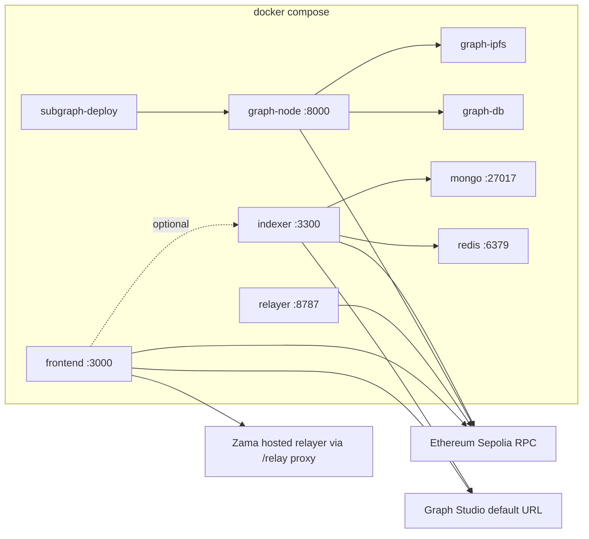

# Docker Compose guide

MedVault ships a **Sepolia-first** Docker Compose stack: one command brings up the Vite frontend against Ethereum Sepolia, hosted Zama fhEVM relayer, and Graph Studio — no local Hardhat node required.

For a quick start, see [LOCAL_DEVELOPMENT.md](./LOCAL_DEVELOPMENT.md).

## Stack overview

| Item | Count | Notes |
|------|------:|-------|
| Dockerfiles | **3** | Root frontend ([Dockerfile](../Dockerfile)), [relayer/Dockerfile](../relayer/Dockerfile), [indexer/Dockerfile](../indexer/Dockerfile) |
| Compose services | **10** | See table below |
| Profiles | **4** | `default` (frontend), `relayer`, `graph`, `indexer` |

**Not containerized:** `ai-service/` and `mcp-server/` run via npm locally or on separate hosts (Railway, etc.). See [LOCAL_DEVELOPMENT.md](./LOCAL_DEVELOPMENT.md).

## Architecture



| Service | Profile | Port | Purpose |
|---------|---------|------|---------|
| `frontend` | default | 3000 | Vite dev server (`target: dev`) |
| `relayer` | `relayer`, `relayer-b` | 8787, 8788 | Optional dual gasless relayers (P3.1); set `WATCHER_ENABLED=false` on relayer-b |
| `graph-ipfs` | `graph` | 5001, 8080 | IPFS for local Graph Node |
| `graph-db` | `graph` | 5433 | Postgres for Graph Node |
| `graph-node` | `graph` | 8000–8030 | Local subgraph indexer (Sepolia RPC) |
| `subgraph-deploy` | `graph` | — | One-shot: codegen, build, deploy to local node |
| `mongo` | `indexer` | 27017 | MongoDB for hybrid indexer cache |
| `redis` | `indexer` | 6379 | Redis for indexer cache |
| `indexer` | `indexer` | 3300 | Off-chain read-cache API (`indexer/`) |

## Quick start

```bash
cp .env.docker.example .env.local
# Edit VITE_PRIVY_APP_ID (required for wallet auth)

docker compose up --build
```

Open **http://localhost:3000**.

### Profiles

```bash
# Default — frontend only
docker compose up --build

# Frontend + local HTTP relayer
docker compose --profile relayer up --build

# Frontend + local Graph Node + subgraph deploy
docker compose --profile graph up --build

# Frontend + hybrid indexer (Mongo, Redis, API on :3300)
docker compose --profile indexer up --build

# Combine profiles as needed
docker compose --profile relayer --profile graph --profile indexer up --build
```

### Indexer profile

The `indexer` profile runs the hybrid read-cache layer documented in [indexer/README.md](../indexer/README.md). It supplements the subgraph for RPC-only events (`SilentApply`, `DocumentRecorded`).

After starting:

```bash
# Optional: point frontend at local indexer API
# Add to .env.local:
VITE_INDEXER_URL=http://localhost:3300
```

The indexer container reads `MEDVAULT_SUBGRAPH_URL` from `VITE_SUBGRAPH_URL` (default: Graph Studio `medvault/v0.2.0`).

## Files

| File | Role |
|------|------|
| [Dockerfile](../Dockerfile) | Multi-stage: `deps` → `dev` → `build` → `production` |
| [relayer/Dockerfile](../relayer/Dockerfile) | Node 22 slim, `node server.js` on port 8787 |
| [indexer/Dockerfile](../indexer/Dockerfile) | Node 22 slim, builds `@medvault/indexer` workspace |
| [docker-compose.yml](../docker-compose.yml) | Service definitions and healthchecks |
| [.env.docker.example](../.env.docker.example) | Sepolia defaults for Compose |

### Frontend Dockerfile stages

| Stage | Command | Use |
|-------|---------|-----|
| `deps` | `npm ci` | Shared dependency layer |
| `dev` | `npm run dev -- --host 0.0.0.0 --port 3000` | **Default Compose target** |
| `build` | `npm run build:prebuilt` | Static production build |
| `production` | `serve -s dist -l 3000` | Serve prebuilt assets |

Production image (not the default Compose target):

```bash
docker build --target production \
  --build-arg VITE_PRIVY_APP_ID=your_id \
  --build-arg VITE_SUBGRAPH_URL=https://api.studio.thegraph.com/query/1755644/medvault/v0.2.0 \
  -t medvault-frontend:prod .
docker run -p 3000:3000 medvault-frontend:prod
```

## Environment variables

### Frontend (`.env.local` or `.env.docker.example`)

| Variable | Required | Description |
|----------|----------|-------------|
| `VITE_PRIVY_APP_ID` | Yes | Privy app ID for wallet auth |
| `VITE_SUBGRAPH_URL` | Yes | Graph Studio query URL (canonical: `medvault/v0.2.0`) |
| `VITE_INDEXER_URL` | No | Hybrid indexer API (default `http://localhost:3300` when using `indexer` profile) |
| `VITE_RECLAIM_ALLOW_SKIP` | No | Skip Reclaim verification in demo (`true` default) |
| `VITE_RELAYER_URL` | No | Override relayer; default uses Vite `/relay` proxy |

Compose passes these via `env_file` and `environment` in [docker-compose.yml](../docker-compose.yml).

### Relayer profile

Create `relayer/.env` from [relayer/.env.example](../relayer/.env.example) or set in root env:

| Variable | Description |
|----------|-------------|
| `RELAYER_PRIVATE_KEY` | EOA that submits relayed txs |
| `REGISTRY_ADDRESS` | Deployed `MedVaultRegistry` |
| `SEMAPHORE_ADDRESS` | Semaphore contract |
| `CONFIDENTIAL_ETH_ADDRESS` | Deployed cETH (post–IERC7984 redeploy) |
| `RPC_URL` | Sepolia JSON-RPC |
| `FRONTEND_URL` | CORS origin (`http://localhost:3000`) |

Authorize the relayer on `ConfidentialETH` via timelocked `scheduleContractAuth` / `applyContractAuth` (see [TIMELOCK_WIRING.md](./TIMELOCK_WIRING.md)).

### Graph profile

| Variable | Default | Description |
|----------|---------|-------------|
| `SEPOLIA_RPC_URL` | publicnode Sepolia | RPC for graph-node indexing |

After `subgraph-deploy` completes, point the frontend at the local subgraph:

```
VITE_SUBGRAPH_URL=http://localhost:8000/subgraphs/name/medvault/medvault
```

(restart the frontend container after changing env).

### Indexer profile

| Variable | Default | Description |
|----------|---------|-------------|
| `SEPOLIA_RPC_URL` | publicnode Sepolia | RPC for on-chain reconciliation |
| `VITE_SUBGRAPH_URL` | Studio `medvault/v0.2.0` | Passed as `MEDVAULT_SUBGRAPH_URL` to indexer |
| `MEDVAULT_NETWORK` | `sepolia` | Network key for indexer |

## Smoke test

Automated health check (requires Docker daemon):

```bash
npm run docker:smoke
```

Builds the frontend service, waits for `:3000` to respond, then tears down. Implemented in [scripts/docker-compose-smoke.mjs](../scripts/docker-compose-smoke.mjs). CI runs this via [.github/workflows/docker-smoke.yml](../.github/workflows/docker-smoke.yml).

## Troubleshooting

| Symptom | Fix |
|---------|-----|
| Blank page / Privy error | Set a real `VITE_PRIVY_APP_ID` in `.env.local` |
| FHE encrypt fails in container | Dev uses `/relay` proxy to Zama testnet relayer; ensure outbound HTTPS works |
| Relayer 403 / CORS | Set `FRONTEND_URL=http://localhost:3000` in relayer env |
| Graph deploy fails | Wait for `graph-node` healthy; re-run `docker compose --profile graph up subgraph-deploy` |
| Indexer unhealthy | Wait for `mongo` and `redis` healthy; check logs on `indexer` service |
| Port 3000 in use | Change `ports` mapping in `docker-compose.yml` |
| Slow first start | `npm ci` inside image; subsequent builds use layer cache |

## What Docker does *not* include

- **No local Hardhat / fhEVM node** — contracts run on Sepolia; FHE uses Zama hosted coprocessor.
- **No Postgres for the app** — only the optional Graph profile uses Postgres.
- **No contract deploy** — use [scripts/deploy.ts](../scripts/deploy.ts) separately; update `addresses.json` and relayer env after redeploy.
- **No ai-service or mcp-server** — run with `npm run ai:dev` and `npm run mcp:dev` outside Compose.

## Related

- [LOCAL_DEVELOPMENT.md](./LOCAL_DEVELOPMENT.md) — quick start + legacy npm path + CI overview
- [VERIFICATION_SNAPSHOT.md](./VERIFICATION_SNAPSHOT.md) — dated docker smoke status
- [internal-docs/srs.md](../internal-docs/srs.md) — NFR-5 (demo runnable via Compose)
