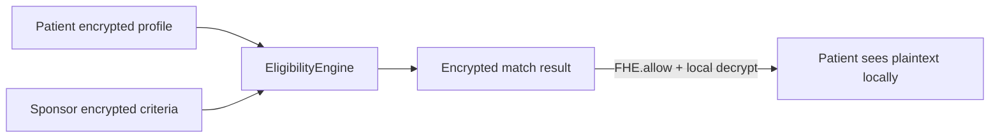
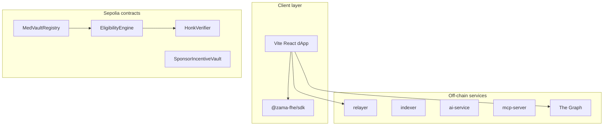

# MedVault Lightpaper

*Confidential clinical trial matching on Zama fhEVM — v0.1 · June 2026*

**Live:** [med-vault.xyz](https://med-vault.xyz) · **FHE audit map:** [FHE_AUDIT_README.md](./FHE_AUDIT_README.md) · **Repo:** [github.com/shery8595/Med-Vault](https://github.com/shery8595/Med-Vault)

---

## Abstract

MedVault homomorphically matches **encrypted patient vitals** against **encrypted sponsor trial criteria** on Ethereum Sepolia using Zama's Fully Homomorphic Encryption (FHE). Validators and indexers never see plaintext PHI — every clinical comparison happens in ciphertext space. Patients decrypt match outcomes locally; sponsors see aggregate signals only.

**The one thing to remember:** private clinical-trial matching — both sides encrypted.

Deployed on Ethereum Sepolia · **491** default Hardhat tests · **17** production Solidity contracts.

---

## 1. The Privacy–Data Paradox

Clinical research needs rich health signals to match patients to trials, but exposing Protected Health Information (PHI) erodes trust and blocks enrollment. Traditional approaches force a trade-off:

| Approach | Problem |
|----------|---------|
| Plaintext on-chain criteria | Competitors and the public see inclusion bounds |
| Encrypt-at-rest only | Data must decrypt to compute eligibility |
| ZK-only attestation | Cannot re-score thousands of profiles when criteria change without re-proving |

**MedVault's insight:** FHE enables *computation* on encrypted medical data — not just storage.

---

## 2. The Solution

### Judge hook

Private clinical-trial matching over encrypted patient vitals and encrypted sponsor trial criteria on Ethereum Sepolia — homomorphic eligibility via Zama FHE.

### Full stack

Beyond matching, MedVault ships an end-to-end research workflow: encrypted inputs, encrypted sponsor criteria, consent gates, anonymous application, audit trail, milestone rewards, and an honest regulatory posture ([REGULATORY_POSTURE.md](./REGULATORY_POSTURE.md)). Optional Semaphore anonymity and Noir identity/policy attestation extend the core FHE stage.

### Personas

- **Alex** (patient) — a 54-year-old with Type 2 diabetes who wants to apply to trials without exposing vitals on-chain.
- **Dr. Chen** (sponsor) — uploads a protocol PDF; AI extracts criteria that are encrypted before landing on-chain.
- **Auditor Sam** — reviews tamper-proof access logs without ever seeing plaintext PHI.

### Core FHE flow

### What is encrypted vs public

| Data | On-chain |
|------|----------|
| Patient vitals (age, Hb, BMI, flags) | **Encrypted** (`euint8` / `euint16` / `ebool`) |
| Sponsor trial criteria | **Encrypted** via `createTrialWithEncryptedCriteria` |
| Eligibility result & propensity score | **Encrypted** (`ebool` / `euint8`) |
| Trial name, phase, sponsor address | Public metadata |

---

## 2b. Limitations & Trust Model

**Canonical trust model:** [TRUST_ARCHITECTURE.md](./TRUST_ARCHITECTURE.md) (in-app: `/docs/trust-architecture`).

| Layer | Guarantees | Does not guarantee |
|-------|------------|-------------------|
| **FHE** | On-chain homomorphic matching (`EligibilityEngine._computeEligibility`) | Off-chain PHI in IPFS, AI service, or indexer; wallet linkage on direct registration; L1 ETH visibility |
| **Noir** | **Identity and policy attestation** (nullifier, profile commitment, staged handle, criteria echo) | fhEVM execution correctness; seal ≠ proof of eligibility |
| **Relayer** | Gasless relay; default patient-decrypt (browser); optional P0.2 relayer-assisted (not default; learns eligibility bit) | Payout integrity via `FHE.select` gating (P2 shipped); relayer cannot steal vault funds, cannot forge eligibility, can only censor or delay — see [formal-verification/certora-halmos-results.md](./formal-verification/certora-halmos-results.md) |
| **Compliance** | Privacy-by-design on-chain matching | **Not HIPAA-compliant today** — see [PRODUCTION_READINESS_COMPLIANCE.md](./PRODUCTION_READINESS_COMPLIANCE.md) |

---

## 3. Architecture

**Repository scale** (from `src/lib/docsStats.ts`):

| Metric | Value |
|--------|------:|
| Production Solidity contracts | 17 |
| Default test suite passing | 491 |
| Registered test cases (incl. fuzz) | ~1,908 |
| In-app documentation pages | 32 |
| MCP tools | 31 |
| HTTP backend routes | 21 |

---

## 4. FHE primitives in MedVault

| Primitive | Contract | Usage |
|-----------|----------|-------|
| `FHE.ge` / `FHE.le` | `EligibilityEngine.sol` | Encrypted patient vs encrypted criteria |
| `FHE.eq` | `EligibilityEngine.sol` | Diabetes, gender, smoker, BP flags |
| `FHE.and` / `FHE.or` | `EligibilityEngine.sol` | Combine encrypted booleans |
| `FHE.select` | `EligibilityEngine.sol` | Encrypted scoring rubric |
| `FHE.add` / `FHE.mul` | `EligibilityEngine` / `EncryptedScoreLeaderboard` | Aggregates |
| `FHE.allow` | All FHE contracts | ACL for patient decrypt |
| `fromExternal` | `AnonymousPatientRegistry`, `TrialManager` | Browser → chain ciphertext ingress |

Full map: [FHE_AUDIT_README.md](./FHE_AUDIT_README.md).

### Sponsor AI criteria extraction

Sponsors upload a protocol PDF in the create-trial wizard. The `ai-service` redacts PHI locally, extracts eligibility bounds, and the sponsor UI encrypts criteria with `@zama-fhe/sdk` before `createTrialWithEncryptedCriteria`. **PHI never reaches the LLM in plaintext** when redaction succeeds.

---

## 5. Optional augmentation layers

These are **not required** for the FHE core story:

| Layer | Role |
|-------|------|
| **Semaphore** | Anonymous apply — wallet decoupled from application |
| **Noir + Honk** | Identity and policy attestation — compliance seal bound to Zama FHE stage handle hash (not fhEVM execution proof) |
| **Chainlink CRE** | Trial expiry finalization |
| **The Graph** | Trial/application indexing |
| **Gasless relayer** | Patient gas abstraction |
| **MCP + SDK** | Sponsor/developer integrations |
| **Android APK** | Capacitor demo shell |

---

## 6. Deployment

- **Network:** Ethereum Sepolia (chain ID `11155111`)
- **Live app:** [med-vault.xyz](https://med-vault.xyz)
- **Addresses:** `packages/medvault-core/data/addresses.json`
- **Terminal demo:** `npm run demo:fhe` ([scripts/demo-fhe-lifecycle.mjs](../scripts/demo-fhe-lifecycle.mjs))

---

## 7. Roadmap

| Phase | Focus |
|-------|-------|
| **v0.1 (current)** | FHE eligibility, encrypted criteria, incentives, Sepolia deploy, dual relayer, 491 tests |
| **v0.2** | Mainnet pilot with sponsor KYC, external security audit |
| **v0.3** | FHIR integration, enterprise subgraph, protocol fee enforcement |
| **v1.0** | Multi-site sponsor network, confidential aggregate analytics API |

---

## 8. Business model

MedVault has **no token**. Revenue from clinical-trial infrastructure:

| Stream | Model |
|--------|-------|
| **Sponsor SaaS** | Per-trial creation + verification fee |
| **Protocol fee** | Percentage on `SponsorIncentiveVault` distributions at settlement |
| **Enterprise** | Private deployments, dedicated relayer/indexer, SLA |

**2026 projections (illustrative — not guarantees):**

| Scenario | Sponsor SaaS | Protocol fees | Enterprise | Total |
|----------|-------------|---------------|------------|-------|
| Conservative | $12K | $5K | $0 | **$17K** |
| Base | $45K | $25K | $30K | **$100K** |
| Optimistic | $120K | $80K | $100K | **$300K** |

---

## 9. Honest limitations

- Direct `registerPatient` links wallet ↔ commitment in one tx (use relayer path for unlinkability). Production registration requires **`profileSaltCommitment`** (random salt; deterministic salts rejected).
- Native ETH `msg.value` visible at transaction layer for deposits/funding.
- Noir attests identity and binding; FHE is sole eligibility authority in encrypted mode. `FHE.select` payout gating (P2) makes payout integrity independent of the attestation layer.
- **Epoch-based key rotation:** fhEVM `FHE.allow` is irreversible; sponsors who already decrypted retain the AES key off-chain. Epoch gating blocks new reads; **`revokeAccess`** rotates keys and emits `DocumentLegacyHandleRevoked` for off-chain unpin.
- **Withdraw/stake sufficiency:** comparison is homomorphic (`FHE.select`); no pre-settlement boolean leak — final ETH transfer amount remains public at settlement.

See [SECURITY.md](../SECURITY.md) and [internal-docs/threat-model.md](../internal-docs/threat-model.md).

---

## 10. Call to action

1. Read the [FHE audit map](./FHE_AUDIT_README.md) (5 minutes).
2. Watch the [demo video](https://youtu.be/7VrcpRRugWc).
3. Try the [live app](https://med-vault.xyz) or run `npm run demo:fhe`.
4. Explore in-app docs at [/docs](https://med-vault.xyz/docs).
