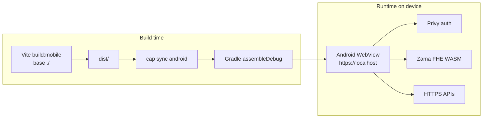

# Mobile architecture (Capacitor Android)

How the MedVault Android APK relates to the Vite web dapp — what is shared, what changes at runtime, and where mobile-specific code lives.

---

## Overview



The APK is **not a React Native rewrite**. It is the same React 19 SPA, packaged as static assets inside a Capacitor shell.

| Layer | Web | Android APK |
|-------|-----|-------------|
| UI | React + Tailwind | Same bundle |
| Routing | React Router 7 | Same (Hash not required — Capacitor uses history API) |
| Wallet | Privy embedded + optional extension | Privy embedded only (reliable in WebView) |
| FHE | `@zama-fhe/sdk` + IndexedDB | Same SDK + storage |
| ZK | Noir WASM + Semaphore | Same WASM assets in APK |
| Relayer | Same-origin proxy (`/api/relayer`, `/relay`) | Direct HTTPS URLs |
| Hosting | Vercel | Bundled in `assets/public/` |

---

## Build pipeline

1. **`npm run build:mobile`** — sets `CAPACITOR_BUILD=true` so Vite uses `base: './'`. Relative asset paths are required for `capacitor://` / `https://localhost` origins.

2. **`npx cap sync android`** — copies `dist/` to `android/app/src/main/assets/public/` and updates native plugin stubs.

3. **Gradle** — compiles the Android shell, packages web assets into `app-debug.apk`.

App metadata:

- **Package id:** `xyz.medvault.app` (`capacitor.config.ts`)
- **WebView scheme:** `https` (`server.androidScheme`) → origin `https://localhost`
- **Version:** `android/app/build.gradle` → `versionName` / `versionCode`

---

## Runtime URL resolution

[`src/lib/mobile.ts`](../src/lib/mobile.ts) centralizes mobile behavior:

```typescript
isNativeApp()           // Capacitor.isNativePlatform()
needsDirectApiUrls()    // native OR capacitor:// / file:// / localhost origins
getZamaRelayerUrl()     // direct HTTPS when proxies unavailable
getMedVaultRelayerUrl() // Railway production URL on native
```

[`src/lib/zamaChain.ts`](../src/lib/zamaChain.ts) re-exports `getZamaRelayerUrl` for Zama SDK chain config.

[`src/lib/relayer.ts`](../src/lib/relayer.ts) uses `getMedVaultRelayerUrl()` for all `/relay/*` HTTP calls.

### Why proxies break on mobile

| Web mechanism | APK equivalent |
|---------------|----------------|
| Vite dev `proxy` in `vite.config.ts` | Not present — use `VITE_*` URLs or defaults in `mobile.ts` |
| Vercel `rewrites` in `vercel.json` | Not present — Zama relayer called at `relayer.testnet.zama.org` |

---

## Mobile-only UI

Components under [`src/components/mobile/`](../src/components/mobile/):

| Component | Behavior |
|-----------|----------|
| `MobileAppShell` | Android back button → router back / minimize app; status bar; splash hide |
| `MobileNetworkBanner` | Sticky offline warning via `@capacitor/network` |
| `MobileLaunchRedirect` | Native app skips marketing landing → `/patient/dashboard` |
| `MobileNativeHints` | Wallet/FHE setup guidance in dashboard shell |

Wired in [`src/App.tsx`](../src/App.tsx) inside `MobileAppShell` wrapper.

CSS safe-area insets: `.native-safe` in [`src/index.css`](../src/index.css).

---

## Capacitor plugins

| Plugin | Purpose |
|--------|---------|
| `@capacitor/app` | Back button, minimize |
| `@capacitor/network` | Connectivity status |
| `@capacitor/splash-screen` | Launch splash |
| `@capacitor/status-bar` | Status bar color |

---

## CORS & auth origins

The WebView sends requests with origin **`https://localhost`**.

Configure:

- **Privy dashboard** — allowed domain `https://localhost`
- **MedVault relayer** — `FRONTEND_URL` includes `https://localhost`

Zama relayer and Sepolia RPC are public HTTPS — no CORS issue for browser fetches from WebView.

---

## Storage & persistence

| Store | Used for |
|-------|----------|
| IndexedDB | Zama FHE keys (`indexedDBStorage` in `ZamaSDKProvider`) |
| localStorage | Semaphore identity, profile metadata |
| Privy session | Auth cookies / SDK session in WebView |

Data survives app restarts unless the user clears app storage or uninstalls.

---

## Performance considerations

- **Bundle size:** ~11 MB JS + multiple WASM modules (Barretenberg, Noir, tfhe). APK ~33 MB.
- **Cold start:** First launch loads WASM; patient dashboard redirect avoids heavy landing Three.js on native.
- **Proof generation:** Noir eligibility proofs are CPU-intensive on mobile — expect 30–90s on mid-tier devices.
- **Memory:** Gradle build uses `NODE_OPTIONS=--max-old-space-size=8192` for Vite; devices need sufficient RAM for WASM peak usage.

---

## Future: iOS

Capacitor supports iOS with `npx cap add ios`. Not implemented in this repo yet. Would share the same `dist/` bundle and `src/lib/mobile.ts` logic.

---

## Related docs

- [ANDROID_APK.md](./ANDROID_APK.md) — build, install, troubleshoot
- In-app: `/docs/mobile/android-apk`
- [Deployment guide](https://med-vault.xyz/docs/deployment) — web + relayer CORS
