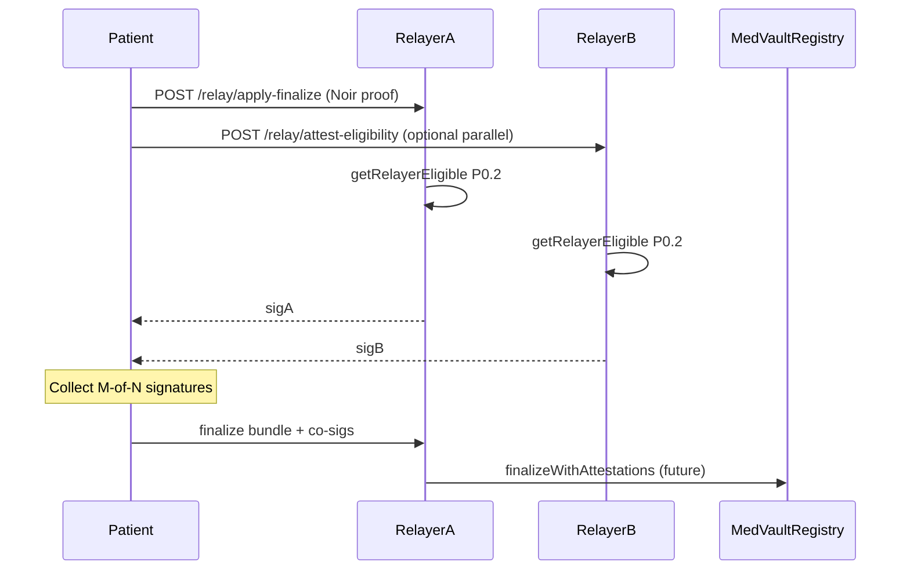

# P3.3 threshold attestation (design spec — not deployed)

**Status:** Design evidence only. On-chain M-of-N co-sign gate is **deferred** until an institutional pilot requires it.

MedVault P3.1 ships **dual independent relayers** (separate hot wallets, shared on-chain allowlist). P3.3 describes how to evolve to **threshold finalize** without changing the FHE eligibility authority.

## Goal

Require **M-of-N** distinct `authorizedRelayers` to sign matching eligibility attestations before any relayer may submit `finalizeAnonymousApplyWithProof`. This:

- Reduces single-relayer censorship at finalize time (any M relayers can co-sign)
- Makes **equivocation** publicly auditable (conflicting signatures for same `(nullifier, trialId)`)
- Does **not** grant relayers fund custody or eligibility write access

## EIP-712 attestation type (off-chain)

```typescript
// Domain: name "MedVaultRelayerAttestation", version "1", chainId, verifyingContract = registry
RelayerEligibilityAttestation {
  registry: address
  trialId: uint256
  nullifier: uint256
  finalCt: bytes32
  eligible: bool
  permitRecipient: address
  deadline: uint256
  relayer: address  // must equal signer and authorizedRelayers[relayer]
}
```

### Attestation flow (future)



1. Patient stages via any relayer (or directly on-chain — `stageAnonymousApply` is open).
2. Each relayer independently runs `getRelayerEligible()` from [`relayer/eligibility-decrypt.mjs`](../relayer/eligibility-decrypt.mjs).
3. Each relayer signs `RelayerEligibilityAttestation` with its hot wallet.
4. **Future contract** (not deployed): `finalizeAnonymousApplyWithProof` accepts `bytes[] relayerSigs` and verifies:
   - `M` distinct addresses in `authorizedRelayers`
   - All signatures match the same `(nullifier, trialId, finalCt, eligible, permitRecipient, deadline)`
   - `eligible == true` (or proceed to silent path if false)
5. Any single relayer may submit the tx once quorum is met.

## Equivocation detection

If Relayer A signs `eligible=true` and Relayer B signs `eligible=false` for the same stage:

- Both attestations are publishable to a monitor / subgraph `RelayerAttestation` entity
- Under P3.3 gate, **neither** attestation set alone reaches quorum if M=2 and votes disagree
- Investigators can correlate with on-chain `AnonymousApplyStaged.finalCt` and FHE engine state

Today (P3.1 only): only the relayer that submits finalize on-chain matters; conflicting off-chain claims are visible if relayers publish attestations voluntarily.

## Pilot parameters

| Parameter | Suggested pilot value |
|-----------|----------------------|
| N | 2 authorized relayers |
| M | 2 (2-of-2) |
| Attestation TTL | Same as stage `deadline` |
| On-chain verifier | New `RelayerAttestationLib` + modifier on finalize (future PR) |

## Explicit non-goals

- Replacing Zama KMS threshold decryption (separate trust domain)
- Patient-open finalize (contradicts HIGH-1 remediation)
- Relayer custody of patient viewing keys beyond staged `permitRecipient` scope

## References

- [RELAYER_TRUST_BOUNDARIES.md](./RELAYER_TRUST_BOUNDARIES.md)
- [TIMELOCK_WIRING.md](./TIMELOCK_WIRING.md) — dual Railway deployment
- `GET /transparency` → `committeeMode: "P3.1-dual-independent"`, `thresholdTarget: "2-of-2 (spec only)"`
