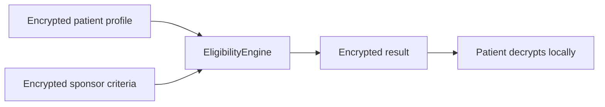

# MedVault Pitch Deck Outline

> **Note:** Render to slides externally (Google Slides, Marp, or Keynote). This file is an outline only — not rendered slides.

---

## Slide 1 — Title

**MedVault**  
*Homomorphic clinical trial matching on Zama fhEVM*

- Live: [med-vault.xyz](https://med-vault.xyz)
- Ethereum Sepolia · 483 tests · 17 contracts

---

## Slide 2 — The problem

**The Privacy–Data Paradox**

- Trials need rich health signals to match patients
- Exposing PHI erodes trust and blocks enrollment
- Encrypt-at-rest doesn't help — you must decrypt to compute
- Plaintext on-chain criteria leak competitive protocol bounds

---

## Slide 3 — Why FHE (not just encryption)

| Traditional encryption | Zama FHE |
|------------------------|----------|
| Lock data at rest | Compute on ciphertext |
| Decrypt to compare | `FHE.ge`, `FHE.eq`, `FHE.select` on-chain |
| Static proofs | Dynamic re-matching when criteria change |

Clinical trials need **computation**, not just a vault.

---

## Slide 4 — MedVault one-liner

> MedVault homomorphically matches **encrypted patient vitals** against **encrypted sponsor trial criteria** on Ethereum Sepolia.

- Patients decrypt match outcomes **locally**
- Sponsors never see plaintext PHI
- Validators never see plaintext PHI

---

## Slide 5 — FHE flow (diagram)

**Proof account binding:** `@zama-fhe/sdk` encrypt → `inputProof` → `FHE.fromExternal` on-chain.

---

## Slide 6 — Encrypted vs public

| Encrypted | Public |
|-----------|--------|
| Patient vitals | Trial name, phase |
| Sponsor criteria bounds | Sponsor address |
| Eligibility result | Trial active flag |
| Aggregate match stats | — |

---

## Slide 7 — Live demo

- **Web:** [med-vault.xyz](https://med-vault.xyz) — patient privacy tour + sponsor create trial
- **Video:** [YouTube walkthrough](https://www.youtube.com/watch?v=1wR01KflBOM&t=88s)
- **Terminal:** `npm run demo:fhe` — scripted Sepolia lifecycle
- *[Screenshot placeholder: sponsor create-trial with encrypted criteria]*

---

## Slide 8 — Architecture

- **17** production contracts (`EligibilityEngine`, `TrialManager`, `MedVaultRegistry`, …)
- **5** runtime services (frontend, relayer, indexer, AI, MCP)
- **The Graph** subgraph for trial/application indexing
- **Optional:** Semaphore anonymity, Noir identity/policy attestation (compliance seal), Chainlink automation

---

## Slide 9 — Differentiation

| Capability | MedVault |
|------------|----------|
| Homomorphic matching on **both** patient + sponsor data | Yes |
| Encrypted sponsor criteria (production default) | `createTrialWithEncryptedCriteria` |
| Clinical domain depth | Full trial lifecycle (consent, incentives, milestones) |
| Judge verification | [FHE_AUDIT_README.md](./FHE_AUDIT_README.md) primitive map |
| Test depth | 483 default / ~2,020 registered |

---

## Slide 10 — AI + FHE sponsor workflow

1. Sponsor uploads protocol PDF
2. PHI redacted locally (`ai-service`)
3. Criteria extracted → sponsor reviews
4. `@zama-fhe/sdk` encrypts bounds
5. `createTrialWithEncryptedCriteria` on Sepolia

**Badge:** PHI-safe — redacted before LLM

---

## Slide 11 — Roadmap

| When | What |
|------|------|
| Now | Sepolia deploy, 483 tests, live demo |
| Next | Mainnet pilot, external audit |
| Future | FHIR, enterprise API, protocol fees on-chain |

---

## Slide 12 — Business model

- **No token** — SaaS + protocol fees
- Sponsor per-trial fees
- % on incentive vault distributions
- Enterprise private deployments

2026 base case projection: **~$100K** (illustrative)

---

## Slide 13 — Call to action

1. [FHE audit map](./FHE_AUDIT_README.md) — 5 min technical review
2. [Live demo](https://med-vault.xyz)
3. `npm install @medvault/sdk` — build on MedVault
4. Questions → GitHub Issues

**Powered by Zama FHE · Ethereum Sepolia**
