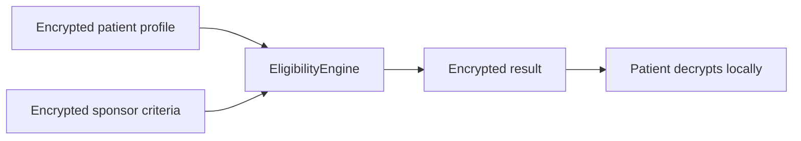

# MedVault Pitch Deck Outline

> **Note:** Render to slides externally (Google Slides, Marp, or Keynote). This file is an outline only — not rendered slides.

---

## Slide 1 — Title

**MedVault**  

*Private clinical-trial matching on encrypted patient and sponsor data*

- Live: [med-vault.xyz](https://med-vault.xyz)

- Ethereum Sepolia · Zama fhEVM

---

## Slide 2 — The problem

**The Privacy–Data Paradox**

- Trials need rich health signals to match patients

- Exposing PHI erodes trust and blocks enrollment

- Encrypt-at-rest doesn't help — you must decrypt to compute

- Plaintext on-chain criteria leak competitive protocol bounds

---

## Slide 3 — Why FHE (not just encryption)

| Traditional encryption | Zama FHE |

|------------------------|----------|

| Lock data at rest | Compute on ciphertext |

| Decrypt to compare | `FHE.ge`, `FHE.eq`, `FHE.select` on-chain |

| Static proofs | Dynamic re-matching when criteria change |

Clinical trials need **computation**, not just a vault.

---

## Slide 4 — MedVault one-liner

> MedVault homomorphically matches **encrypted patient vitals** against **encrypted sponsor trial criteria** on Ethereum Sepolia.

**The one thing to remember:** private clinical-trial matching — both sides encrypted.

- Patients decrypt match outcomes **locally**

- Sponsors never see plaintext PHI **during on-chain scoring** (consent-gated document/profile access is a separate, patient-controlled flow)

- Validators never see plaintext PHI during on-chain scoring

---

## Slide 5 — FHE flow (diagram)

**Proof account binding:** `@zama-fhe/sdk` encrypt → `inputProof` → `FHE.fromExternal` on-chain.

---

## Slide 6 — Encrypted vs public

| Encrypted | Public |

|-----------|--------|

| Patient vitals | Trial name, phase |

| Sponsor criteria bounds | Sponsor address |

| Eligibility result | Trial active flag |

| Aggregate match stats | — |

---

## Slide 7 — Live demo

- **Web:** [med-vault.xyz](https://med-vault.xyz) — patient privacy tour + sponsor create trial

- **Video:** [YouTube walkthrough](https://youtu.be/7VrcpRRugWc)

- **Terminal:** `npm run demo:fhe` — scripted Sepolia lifecycle

- *[Screenshot placeholder: sponsor create-trial with encrypted criteria]*

---

## Slide 8 — Platform depth (supporting evidence)

MedVault is the **reference fhEVM architecture for encrypted clinical-trial matching** — platform breadth proves the core is production-shaped, not the pitch opener.

| Layer | What ships |

|-------|------------|

| **Core FHE matching** | `EligibilityEngine`, encrypted patient inputs, `createTrialWithEncryptedCriteria` |

| **Trust & identity** | Consent gates, anonymous application, identity/policy attestation seal |

| **Operations** | Audit trail, milestone rewards, trial finalization |

| **Platform Services** *(secondary)* | MCP sponsor tools, AI PDF criteria extraction, Chainlink CRE trial finalization, Capacitor Android wrapper, confidential cETH staking |

| **Verification** | 491 tests, dual relayer bounds, [FHE audit map](./FHE_AUDIT_README.md) |

See [JUDGE_BRIEF.md](./JUDGE_BRIEF.md) for the 2-page technical summary.

---

## Slide 9 — Workflow differentiation

| Capability | MedVault |

|------------|----------|

| Homomorphic matching on **both** patient + sponsor data | Yes |

| Encrypted sponsor criteria (production default) | `createTrialWithEncryptedCriteria` |

| Full research workflow | Consent · anonymous apply · audit trail · incentives · honest regulatory posture |

| Judge verification | [FHE_AUDIT_README.md](./FHE_AUDIT_README.md) primitive map |

| Relayer trust bounds | [RELAYER_TRUST_BOUNDARIES.md](./RELAYER_TRUST_BOUNDARIES.md) — cannot steal vault funds, cannot forge eligibility, can only censor or delay · **Canonical trust model:** [TRUST_ARCHITECTURE.md](./TRUST_ARCHITECTURE.md) |

| Multi-relayer (P3.1) | Dual Railway relayers + patient picker; default patient-decrypt (browser); P3.3 threshold spec (deferred — agreement, not confidentiality) |

| Test depth | 491 default / ~2,028 registered · 17 production contracts |

---

## Slide 10 — AI + FHE sponsor workflow

*Sponsor onboarding accelerant — not the opening hook.*

1. Sponsor uploads protocol PDF

2. PHI redacted locally (`ai-service`)

3. Criteria extracted → sponsor reviews

4. `@zama-fhe/sdk` encrypts bounds

5. `createTrialWithEncryptedCriteria` on Sepolia

**Badge:** PHI-safe — redacted before LLM

---

## Judge demo checklist (dual relayer)

1. `GET https://relayer-a.../health` and `GET https://relayer-b.../health` — both `relayerAuthorized: true`

2. Apply wizard shows two relayers green; switch relayer and submit anonymous apply

3. `GET /transparency` on each relayer — `committeeMode: P3.1-dual-independent`, `defaultDecryptPath` (patient-decrypt browser), metrics counters. Do **not** demo P0.2 relayer-assisted decrypt unless explaining the visibility tradeoff.

4. Run `npx hardhat test test/unit/relayer-adversarial.test.ts` — REL-EQV/REP/FF/STALE

5. Subgraph: query `authorizedRelayers` and `relayerRegistrations` after deploy v0.2.1+

---

## Slide 11 — Roadmap

| When | What |

|------|------|

| Now | Sepolia deploy, 491 tests, dual relayer, live demo |

| Next | Mainnet pilot, external audit |

| Future | FHIR, enterprise API, protocol fees on-chain |

---

## Slide 12 — Business model

- **No token** — SaaS + protocol fees

- Sponsor per-trial fees

- % on incentive vault distributions

- Enterprise private deployments

2026 base case projection: **~$100K** (illustrative)

---

## Slide 13 — Call to action

1. [FHE audit map](./FHE_AUDIT_README.md) — 5 min technical review

2. [Live demo](https://med-vault.xyz)

3. `npm install @medvault/sdk` — build on MedVault

4. Questions → GitHub Issues

**Powered by Zama FHE · Ethereum Sepolia**

