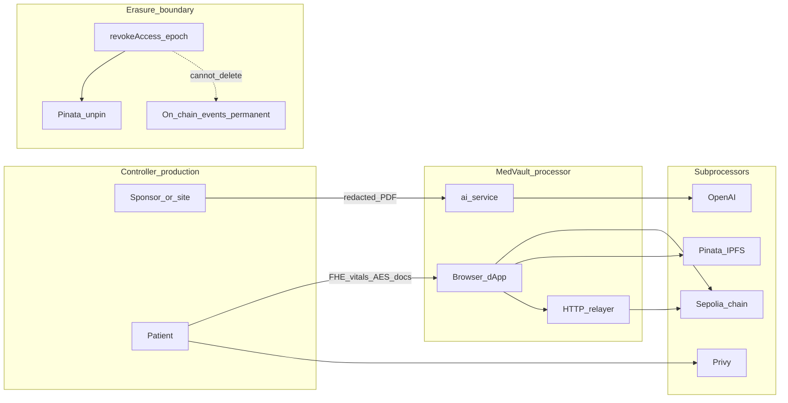

# Production Readiness & Compliance Notes

> **Disclaimer:** This document is a production-readiness **gap checklist**, not legal advice or regulatory certification. MedVault is **not HIPAA-compliant today** and is **not GDPR-certified**.

**Scope:** Reference architecture for encrypted **clinical-trial matching** on Sepolia — not a HIPAA-covered entity, not IRB-approved enrollment, not FDA-validated SaMD.

**Status:** Demo / pre-pilot ([v0.2 roadmap](./LIGHTPAPER.md#7-roadmap): mainnet pilot, sponsor KYC, external audit).

**Detail:** [REGULATORY_POSTURE.md](./REGULATORY_POSTURE.md) · [HYBRID_STORAGE.md](./HYBRID_STORAGE.md) · [RELAYER_TRUST_BOUNDARIES.md](./RELAYER_TRUST_BOUNDARIES.md) · [ai-service/README.md](../ai-service/README.md)

---

## I. HIPAA gap checklist

| Control | Status | Evidence | Next step |
|---------|--------|----------|-----------|
| §164.312(a) Access control | **Partial** | FHE ACL in `EligibilityEngine.sol`; encrypted consent in `ConsentManager.sol` | Govern sponsor off-chain decrypt after `pullSponsorKeyAccess` |
| §164.312(a)(2)(iv) Encryption | **Partial** | FHE client encrypt (`fhe.ts`); AES-256-GCM docs (`EncryptionService.ts`) | Document browser-plaintext window; relayer/indexer metadata policy |
| §164.312(b) Audit controls | **Implemented** | `DataAccessLog.sol` logs `keccak256` patient hashes only | Add validated export SOP for sponsors |
| §164.312(e) Transmission security | **Partial** | Vitals as FHE ciphertext over RPC; docs as AES ciphertext to IPFS (`ipfs.ts`) | TLS + BAA coverage for all PHI-touching vendors |
| §164.308 Administrative safeguards | **Missing** | No formal risk analysis, training, or incident-response runbook in repo | Publish HIPAA risk analysis + breach SOP |
| §164.314 BAAs & breach notification | **Missing** | No executed BAAs; no §164.404 procedure | Execute vendor BAAs (Section II); sponsor retention clauses per [HYBRID_STORAGE.md § Known limitation](./HYBRID_STORAGE.md#known-limitation-forward-only-revocation) |

---

## II. BAA / vendor posture

MedVault operator would sign BAAs as **Business Associate** when deploying for covered-entity sponsors; sponsors remain covered entities for enrollment decisions.

| Vendor | PHI exposure | Mitigation today | BAA/DPA | Next step |
|--------|--------------|------------------|---------|-----------|
| **Pinata / IPFS** | AES ciphertext blobs; CID on-chain | Client encrypt; indexer unpin on `DocumentLegacyHandleRevoked` (`ipfsUnpin.ts`) | **Missing** | Pinata enterprise BAA; secrets in vault |
| **OpenAI** (ai-service) | Redacted protocol text only | Regex then NER redaction before LLM (`redaction.ts`); `AI_NO_RETENTION` default (`config.ts`) | **Missing** | Zero-data-retention API tier + DPA |
| **Privy** | Auth identity; optional wallet↔patient link | Semaphore anonymous apply decouples wallet (`semaphore.ts`) | **Missing** | Privacy policy; minimize linkage in prod |
| **Vercel** | Static SPA only | PHI stays client-side / encrypted off-host | **Missing** | Confirm no server-side body logging |
| **Railway** | Relayer staging logs; P0.2 eligibility re-decrypt | Trust bounds in [RELAYER_TRUST_BOUNDARIES.md](./RELAYER_TRUST_BOUNDARIES.md) | **Missing** | BAA; logging policy; VPC for indexer Mongo |
| **Zama fhEVM relayer** | Ciphertext handles only | Proxied via Vercel; FHE SDK in `fhe.ts` | **N/A** | List as subprocessor in ROPA |

---

## III. GDPR data-flow & erasure boundary

| GDPR theme | Status | Notes | Next step |
|------------|--------|-------|-----------|
| Lawful basis (Art. 6/9) | **Missing** | Demo asserts no production basis | Document consent + Art. 9(2)(a) for pilot |
| Controller / processor roles | **Partial** | Sponsor-as-controller architecture; not contracted | Sign controller–processor agreements |
| DPA / ROPA (Art. 28/30) | **Missing** | No subprocessors register or DPAs | Publish ROPA; execute Section II DPAs |
| Right to erasure (Art. 17) | **Partial** | Off-chain: `revokeAccess` + Pinata unpin; on-chain events persist | Patient disclosure of immutability limit |

---

## IV. 21 CFR Part 11 (clinical-trial positioning)

Design alignment only — not a validation package.

| Part 11 theme | Status | MedVault component | Next step |
|---------------|--------|-------------------|-----------|
| Audit trail | **Partial** | `DataAccessLog.sol` + subgraph/indexer mirrors | Validated export, retention schedule, time sync |
| Electronic signatures | **Partial** | EIP-712 in `ConfidentialETH7984.sol`, claim/apply permit sigs | Bind signature meaning to IRB consent form |
| System validation (IQ/OQ/PQ) | **Missing** | Contracts + off-chain services | Formal IQ/OQ/PQ protocol |
| Record integrity | **Implemented** | On-chain immutability | Document off-chain IPFS copy risk until unpin |

---

## V. Path to institutional pilot / IRB

An institutional pilot would require IRB (or equivalent ethics) review covering: protocol-specific informed consent beyond the on-chain `EncryptedConsentGate` / `ConsentManager` technical state; witness/pediatric consent where applicable; adverse-event and protocol-amendment procedures; and patient-facing disclosure of hybrid IPFS/FHE storage, wallet linkage (vs Semaphore anonymous path), and the limit that on-chain audit metadata cannot be erased. MedVault does not supply IRB submission documents today. Pre-pilot engineering gates: external security audit ([EXTERNAL_AUDIT_SUMMARY.md](./EXTERNAL_AUDIT_SUMMARY.md)), BAAs (Section II), sponsor KYC (`SponsorRegistry.sol` allowlist → production KYC vendor).
