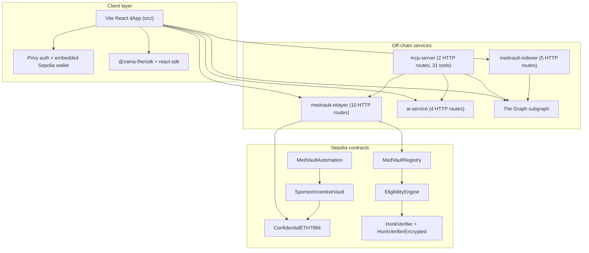
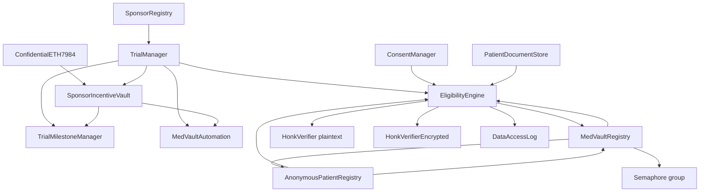

# Architecture

MedVault is a Sepolia-first fhEVM clinical-trial protocol: React dApp, off-chain services (relayer, indexer, AI, MCP), The Graph subgraph, and **17** production Solidity contracts (see [`src/lib/docsStats.ts`](../src/lib/docsStats.ts)).

## Layered view

## Contract inheritance graph

All protocol contracts are **direct deployments** — no proxies, UUPS, or `Initializable`. Address changes use owner-gated **schedule → apply** timelocks (typically 6 hours).

```mermaid
flowchart TD
    subgraph zama [Zama / OpenZeppelin bases]
        ZEC[ZamaEthereumConfig]
        ERC7984[ERC7984]
        EIP712[EIP712]
        IERC7984R[IERC7984Receiver]
        BaseHonk[BaseHonkVerifier abstract]
        AutoIface[AutomationCompatibleInterface]
    end

    ZEC --> MVR[MedVaultRegistry]
    ZEC --> APR[AnonymousPatientRegistry]
    ZEC --> TM[TrialManager]
    ZEC --> EE[EligibilityEngine]
    ZEC --> CM[ConsentManager]
    ZEC --> SR[SponsorRegistry]
    ZEC --> ECG[EncryptedConsentGate]
    ZEC --> ESL[EncryptedScoreLeaderboard]
    ZEC --> PDS[PatientDocumentStore]
    ZEC --> SM[StakingManager]
    ZEC --> SIV[SponsorIncentiveVault]
    ZEC --> CETH7984[ConfidentialETH7984]

    ERC7984 --> CETH7984
    EIP712 --> CETH7984
    CETH7984 --> CETH[ConfidentialETH alias]

    EIP712 --> SIV
    IERC7984R --> SIV
    IERC7984R --> SM

    BaseHonk --> HV[HonkVerifier]
    BaseHonk --> HVE[HonkVerifierEncrypted]
    AutoIface --> MVA[MedVaultAutomation]

    DAL[DataAccessLog standalone]
    TMM[TrialMilestoneManager standalone]
```

## Contract dependency graph (runtime calls)

## Frontend architecture

There is **no** `src/contexts/` or `src/routes/` directory. React contexts live under `src/lib/`; routing is declared inline in `src/App.tsx` (~58 `<Route>` elements including legacy `Navigate` aliases).

**Provider nesting** (outer → inner):

`PrivyProvider` → `Web3Provider` → `ZamaSDKProvider` (`QueryClientProvider` + `ZamaProvider`) → `EncryptedDataProvider` → `BrowserRouter` → `MobileAppShell`

| Context | File | Responsibility |
|---------|------|----------------|
| Web3 | `src/lib/Web3Context.tsx` | Privy auth, Sepolia chain enforcement, Ethers provider/signer, `isFHEReady` |
| ZamaSDK | `src/lib/ZamaSDKProvider.tsx` | `@zama-fhe/react-sdk` config, TanStack Query client |
| EncryptedData | `src/lib/EncryptedDataContext.tsx` | In-memory revealed-score cache for sponsor views |

**State model:** page-local `useState` + the three contexts above + TanStack Query (scoped in `ZamaSDKProvider`) + `localStorage` for Semaphore identity (`medvault_identity`), anonymous nullifiers, and pending hybrid document uploads (`pendingHybridDocument.ts`).

## Off-chain background jobs

| Job | Location | Role |
|-----|----------|------|
| Withdraw watcher | `relayer/watcher.mjs` | Poll cETH / staking events; `revealWithdrawToAmountFor` + `completeWithdrawTo` / `completePublicExit` |
| Batch exit queue | `relayer/batch-exit-queue.mjs` | Batch private public-exit completions until `minBatchSize` or `maxWaitMs` |
| Indexer sync | `indexer/src/sync.ts` | Subgraph + RPC event ingestion into MongoDB |
| Indexer reconcile | `indexer/src/reconcile.ts` | Periodic subgraph vs DB trial-count desync alerts |
| Chainlink upkeep | `contracts/MedVaultAutomation.sol` | Keeper-triggered milestone / pool automation |

## HTTP surface (21 routes)

| Service | Routes |
|---------|--------|
| **relayer** (`relayer/server.js`, 10) | `GET /health`; `POST /relay/pin-document`, `/relay/apply-stage`, `/relay/apply-finalize`, `/relay/register`, `/relay/claim`, `/relay/register-anon`, `/relay/completion-proof`, `/relay/public-exit`, `/relay/apply` (deprecated) |
| **ai-service** (`ai-service/src/server.ts`, 4) | `GET /health`; `POST /ai/extract-criteria`, `/ai/audit-logs`, `/ai/validate-criteria` |
| **indexer** (`indexer/src/api.ts`, 5) | `GET /health`, `/alerts`, `/trials`, `/sponsor/:addr/stats`, `/trial/:id/applications` |
| **mcp-server** (`mcp-server/src/http.ts`, 2) | `GET /health`; `POST/GET /mcp` (streamable HTTP transport for 31 MCP tools) |

## Dual documentation model

| Layer | Location | Audience |
|-------|----------|----------|
| **In-app docs** | `src/pages/docs/*.tsx` | End users, sponsors, integrators browsing `/docs` |
| **Repo markdown** | `docs/`, `internal-docs/`, `README.md` | Engineers, judges, CI, GitHub readers |
| **Canonical stats** | `src/lib/docsStats.ts` | Single numeric source (`REPO_STATS`, `STAT_BACKING`); methodology in `docs/AUDIT.md` |

In-app pages mirror repo narratives where possible; counts and integration lists must import from `docsStats.ts`, not hard-code. Formal engineering specs (`internal-docs/`) link to operational runbooks under `docs/`.

## Asset sync pipelines

After `npm run compile` or deploy:

| Script | Outputs |
|--------|---------|
| `scripts/sync-abis.js` | `artifacts/contracts` → `src/lib/contracts/abis/`; subgraph subset → `subgraph/abis/`; `ConfidentialETH.json` ← `ConfidentialETH7984.json` |
| `scripts/sync-sdk-assets.mjs` | `src/lib/contracts/{addresses,abis}` → `packages/medvault-core/data/` |
| `scripts/update-subgraph-yaml.js` | `subgraph/subgraph.yaml` start blocks + contract addresses from `addresses.json` |
| `scripts/compile-circuit-wsl.sh` / `compile-circuit.js` | Noir dual-circuit compile → `src/lib/circuits/*.json` → `generate-honk-verifier` → both Honk verifiers |

Typical post-deploy sequence: `npm run sync-abis` → `npm run sync-sdk-assets` → `node scripts/update-subgraph-yaml.js [network]`.

## Key design decisions

- **IERC7984 cETH:** `ConfidentialETH7984` subclasses OpenZeppelin `ERC7984` + `EIP712`; `ConfidentialETH` is a one-line alias for backward-compatible addresses/ABIs.
- **Singleton vault:** Per-trial pools keyed by `trialId` in one `SponsorIncentiveVault` (no clone factory).
- **Anonymous apply:** Two-transaction `stageAnonymousApply` → `finalizeAnonymousApplyWithProof` (Noir/Honk attestation); no on-chain KMS decrypt of eligibility.
- **No upgrade proxies:** Wiring changes via timelocked `schedule*` / `apply*` on each contract; see `docs/TIMELOCK_WIRING.md`.
- **Sepolia-first demo:** Default Docker Compose serves frontend + optional relayer/indexer profiles; local Hardhat chain is optional for developers.
