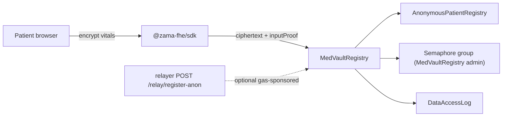
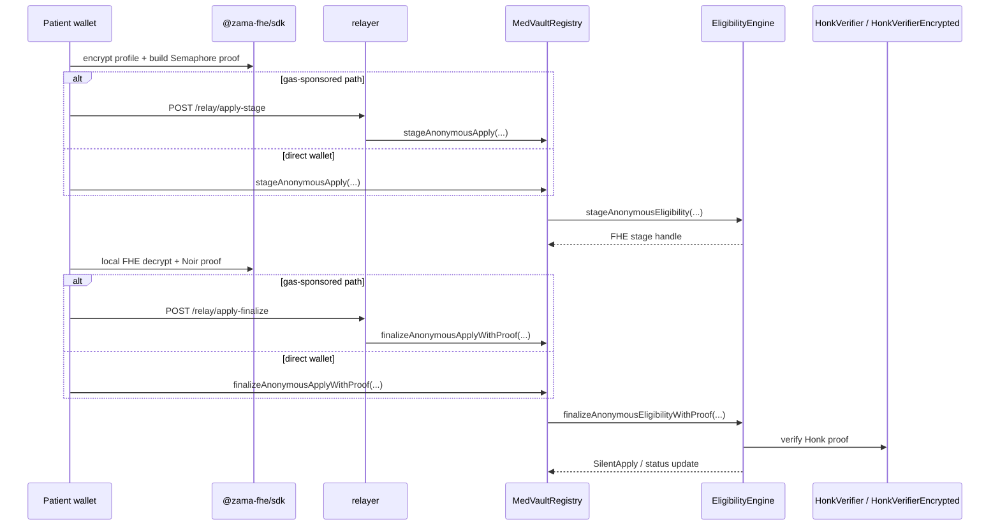
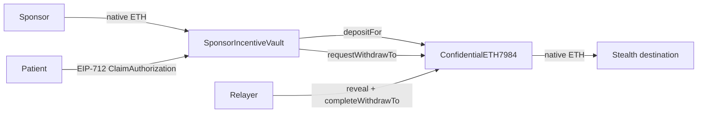
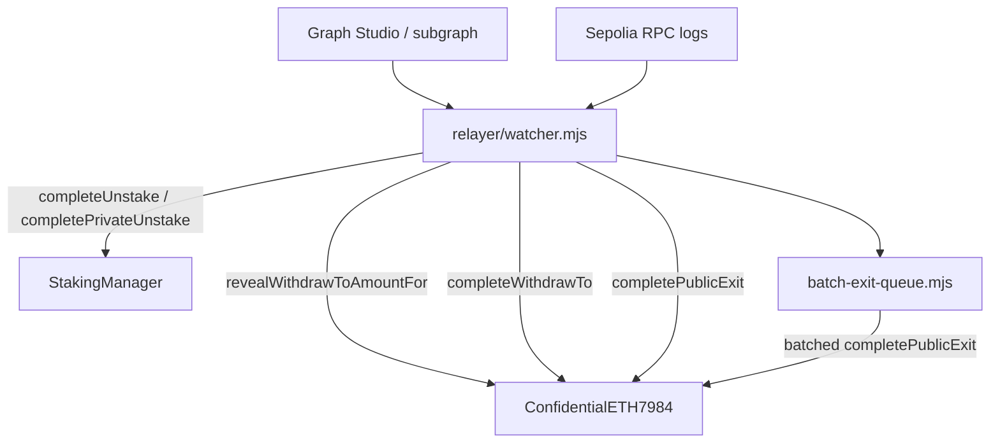
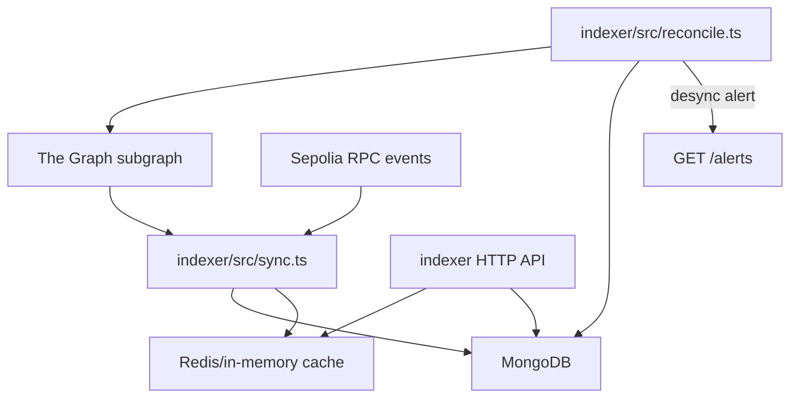
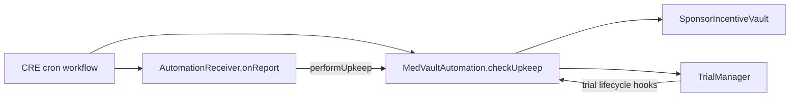
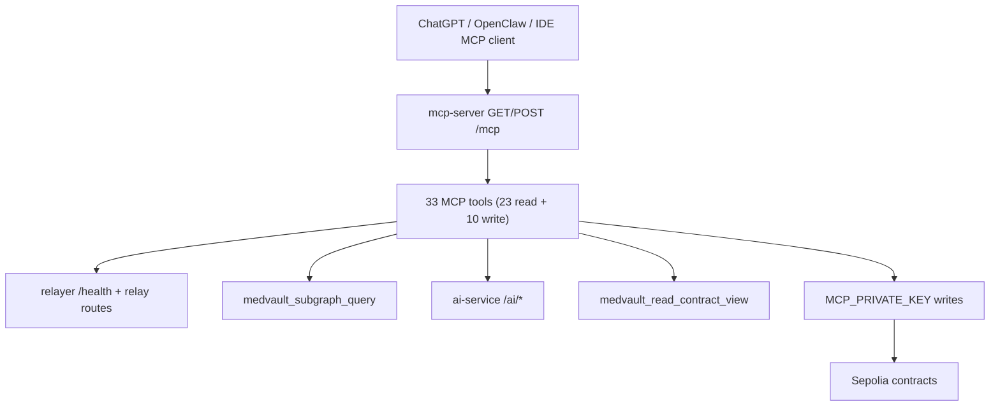

# Data Flow Diagrams (DFD)

Canonical counts: [`src/lib/docsStats.ts`](../src/lib/docsStats.ts) (`httpRoutes: 21`, `backgroundJobs: 5`).

## DFD-1 Patient registration

## DFD-2 Anonymous apply (stage → finalize)

Two on-chain transactions; eligibility FHE is staged in tx 1 and finalized with a Noir/Honk proof in tx 2. No on-chain KMS decrypt of the eligibility bit.

**Relayer routes:** `POST /relay/apply-stage`, `POST /relay/apply-finalize` (legacy `POST /relay/apply` returns deprecation notice).

## DFD-3 Sponsor fund → claim → private withdraw

**Relayer routes:** `POST /relay/claim`, `POST /relay/completion-proof`, `POST /relay/public-exit`.

## DFD-4 Relayer watcher + batch exit queue

Two cooperating background jobs in `relayer/`:

| Job | File | Trigger |
|-----|------|---------|
| Withdraw watcher | `relayer/watcher.mjs` | Poll interval (`pollMs`, default 15s) |
| Batch exit queue | `relayer/batch-exit-queue.mjs` | `minBatchSize` or `maxWaitMs` flush |

See [docs/PRIVATE_WITHDRAWALS.md](../docs/PRIVATE_WITHDRAWALS.md) for withdraw state machines.

## DFD-5 Indexer sync and reconcile

| Job | File | Trigger |
|-----|------|---------|
| Indexer sync | `indexer/src/sync.ts` | Startup + periodic sync loop |
| Indexer reconcile | `indexer/src/reconcile.ts` | `reconcileIntervalMs` timer |

**Indexer HTTP routes (5):** `GET /health`, `/alerts`, `/trials`, `/sponsor/:addr/stats`, `/trial/:id/applications`.

## DFD-6 Chainlink CRE trial finalization

Background job: CRE workflow + on-chain `MedVaultAutomation.sol` (no separate MedVault Node cron).

## DFD-7 MCP tool flows

**MCP HTTP routes (2):** `GET /health`, streamable `POST/GET /mcp`.

Representative read tools: `medvault_get_active_trials`, `medvault_get_sponsor_matches`, `medvault_get_audit_logs`, `medvault_check_wiring`.

Representative write tools: `medvault_create_trial`, `medvault_fund_trial_pool`, `medvault_update_application_status`, `medvault_reclaim_trial_pool`, `medvault_reclaim_abandoned_pool`.

## HTTP route inventory (21 total)

| # | Method | Path | Service |
|---|--------|------|---------|
| 1 | GET | `/health` | relayer |
| 2 | POST | `/relay/pin-document` | relayer |
| 3 | POST | `/relay/apply-stage` | relayer |
| 4 | POST | `/relay/apply-finalize` | relayer |
| 5 | POST | `/relay/cancel-stage` | relayer |
| 6 | POST | `/relay/register` | relayer |
| 7 | POST | `/relay/claim` | relayer |
| 8 | POST | `/relay/register-anon` | relayer |
| 9 | POST | `/relay/completion-proof` | relayer |
| 10 | POST | `/relay/public-exit` | relayer |
| 11 | GET | `/transparency` | relayer |
| 12 | POST | `/relay/apply` | relayer (deprecated) |
| 11 | GET | `/health` | ai-service |
| 12 | POST | `/ai/extract-criteria` | ai-service |
| 13 | POST | `/ai/audit-logs` | ai-service |
| 14 | POST | `/ai/validate-criteria` | ai-service |
| 15 | GET | `/health` | indexer |
| 16 | GET | `/alerts` | indexer |
| 17 | GET | `/trials` | indexer |
| 18 | GET | `/sponsor/:addr/stats` | indexer |
| 19 | GET | `/trial/:id/applications` | indexer |
| 20 | GET | `/health` | mcp-server |
| 21 | * | `/mcp` | mcp-server |

## Background job inventory (5 total)

| # | Job | Location |
|---|-----|----------|
| 1 | Withdraw watcher | `relayer/watcher.mjs` |
| 2 | Batch exit queue | `relayer/batch-exit-queue.mjs` |
| 3 | Indexer sync | `indexer/src/sync.ts` |
| 4 | Indexer reconcile | `indexer/src/reconcile.ts` |
| 5 | Chainlink CRE | `contracts/MedVaultAutomation.sol`, `contracts/cre/AutomationReceiver.sol`, `cre/my-workflow` |
